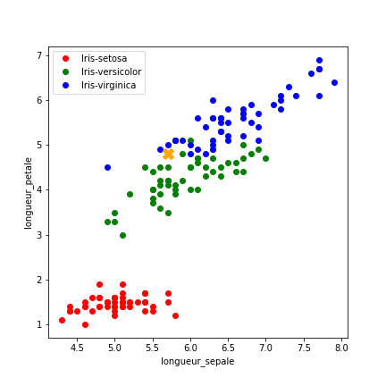
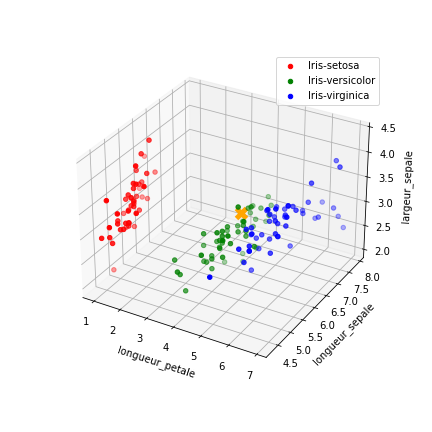
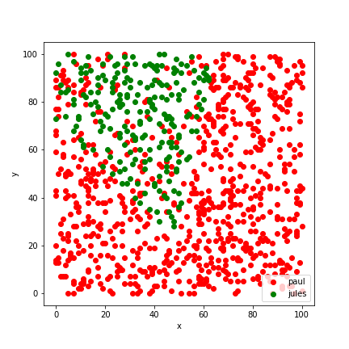
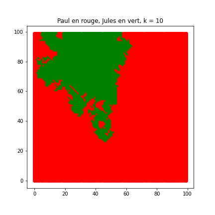

---
title : TP sur l'algorithme des k plus proches voisins
subtitle: Thème algorithmique
author : Première NSI,  [Lycée du Parc](https://frederic-junier.org/)
numbersections: true
fontsize: 11pt
geometry:
- top=20mm
- left=20mm
- right=20mm
- heightrounded    
--- 
 
<!-- Définition des hyperliens  -->

[Python]: https://docs.python.org/3/tutorial/datastructures.html
[Python-tutor]: http://pythontutor.com/visualize.html#mode=edit

# Crédits {-} 
 
_Ce  TP est inspiré pour la partie 2 d'un travail de Julien de Villèle._


<!-- Définition des hyperliens  -->


# Partie 1 : implémentation de l'algorithme des k plus proches voisins


1. Ouvrir dans un environnement de programmation Python le fichier `tp_eleve.py` qui est fourni.
2. Lister le contenu du répertoire  `datas` qui est fourni.
3. Quel est le rôle de l'instruction `from from utilitaires_knn import *` ?
4. En suivant les spécifications données dans les `docstring` et à l'aide du cours, compléter les différentes fonctions permettant d'implémenter l'algorithme de recherche des k plus proches voisins dans `tp_eleve.py` et dans l'encadré ci-dessous.
_Petite différence avec le cours : on utilise une clef de tri dans la fonction `trier_puis_extraire`. Par défaut, `sorted` trie les `tuple`  par ordre alphabétique sur les  composantes (selon la première, puis la seconde etc ...) donc on n'aurait pas besoin de préciser qu'on veut trier selon la première composante (les distances). Néanmoins, si on ne précise pas la clef de tri,  `sorted` va trier en cas d'égalité de distance selon l'ordre alphabétique des étiquettes, ce qui est arbitraire et donne des résultats différents que la méthode de tri différente présentée dans la partie 3._
5. Vérifier  chaque fonction avec le test unitaire fourni dans `tp_eleve.py`  qui s'exécute avec la syntaxe `test_unitaire_nom_fonction()` sur le jeu de données `pokemons.csv`.


~~~python

from utilitaires_knn import *
import math
import random

#%% Partie 1 : implémentation


def distance_euclidienne(enreg_a, enreg_b, tab_descripteur):
    """
    Parameters
    ----------
        enreg_a, enreg_b et deux enregistrements de données sous forme de 
        dictionnaires
        tab_descripteur un tableau de descripteurs (certaines clefs des 
                                                    enregistrements)
    
    Returns
    -------
        distance euclidienne entre enreg_a et enreg_b selon les valeurs des 
        descripteurs de tab_descripteur arrondie à 3 chiffres après la virgule
    """
    distance_carre = 0
    for descripteur in tab_descripteur:
        "à compléter "
        
        
        
    return round(math.sqrt(distance_carre), 3)


def table_distance_nouveau(table, nouveau, distance, etiquette, tab_descripteur):
    """
    Parameters
    ----------
    table : une table d'enregistrements de type dictionnaire
    nouveau : un nouvel enregistrement de type dictionnaire
    distance : une fonction de distance entre deux enregistrements
    etiquette : nom du descripteur d'étiquette dans les enregistrements
    tab_descripteur : un tableau avec les noms des descripteurs utilisés
    dans le calcul de la distance
    
    Returns
    -------
    tab_distance un tableau de tuple (distance entre nouveau et un 
    enregistrement de table, étiquette de cet enregistrement)
    """    
    tab_distance = []
    for enreg in table:
        "à compléter "
        
       
    return tab_distance

def clef_tri(couple):
    """Clef de tri pour trier un couple de valeurs selon
    la première composante"""
    return couple[0]


def trier_puis_extraire(tab_distance, k):
    """
    Parameters
    ----------
    tab_distance un tableau de tuple (distance entre deux  enregistrements
    , étiquette) renvoyé par table_distance_nouveau
    
    Returns
    -------
    tableau k_voisins des k plus petits éléments de tab_distance
    selon le critère de distance
    """
    #précondition
    assert k <= len(tab_distance)
    #tri selon la première composante de chaque tuple (la distance)
    tab_tri = sorted(tab_distance, key = clef_tri)
    "à compléter "
    
    
    
    
    

def element_majoritaire(k_voisins):
    """
    Parameters
    ----------
    k_voisins : tableau des k plus proches voisins 

    Returns
    -------
    voisin_majoritaire : chaine de caractère type str, étiquette majoritaire
    parmi les voisins
    """
    occurence = dict()
    voisin_majoritaire = k_voisins[0]
    for voisin in k_voisins:
        if voisin not in occurence:
            occurence[voisin] = 1
        else:
            "à compléter "
            
            
        if voisin != voisin_majoritaire  \
           and occurence[voisin] > occurence[voisin_majoritaire]:
            "à compléter "
            
            
    return voisin_majoritaire    


def etiquetage_knn(table, nouveau, etiquette, tab_descripteur, k,
                   distance = distance_euclidienne):
    """
    Parameters
    ----------
    table : tableau de dictionnaires
        table d'enregistrements
    nouveau : un dictionnaire
        un nouvel enregistrement
    etiquette : une chaine de caractères
        le nom du descripteur d'étiquette
    tab_descripteur : un tableau
        liste des noms des descripteurs utilisés pour la comparaison
    k : un entier
        le nombre de voisins examinés
    distance : une fonction distance
        The default is distance_euclidienne.

    Returns
    -------
    voisin_majoritaire : une chaine ce caractère
        l'étiquette majoriataire parmi les k plus proches voisins
    """
    "à compléter "
    
    
    
    


#fin
~~~

# Partie 2 : application à un jeu de données historique

Le jeu de données auquel nous allons nous intéresser est un jeu de données célèbre. Il a été créé et utilisé par Ronald Aylmer Fisher en 1936 (biologiste et statisticien) et concerne 3 espèces d'iris : setosa, virginica et versicolor.  Voir [l'article de Wikipedia](https://fr.wikipedia.org/wiki/Iris_de_Fisher) pour les photos des iris et plus de détails.

Ce jeu de données est composé de 50 individus pour chacune des trois espèces (setosa, versicolor, virginica) soit 150 individus en tout.  


Pour chacun de ces individus on dispose des champs :
```
- id              : numéro d'échantillon (identifiant)  

- longueur_sepale : longueur des sépales  

- largeur_sepale  : largeur des sépales  

- longueur_petale : longueur des pétales  

- largeur_petale  : largeur des pétales  

- espece          : 'Iris-setosa', 'Irid_virginica' ou 'Iris-versicolor'
```

La question que se posait M. Fisher est : "Puis-je, à partir des longueurs et largeurs des sépales et pétales, prédire l'espèce d'un iris ?"

On va donc, à partir des quatre descripteurs `longueur_sepale, largeur_sepale, longueur_petale` et `largeur_petale`,  rechercher une prédiction de l'étiquette `espece`.

On travaille toujours dans le fichier `tp_eleve.py`.

1. Rechercher l'emplacement du fichier  `iris.csv` puis charger dans une variable `table_iris` son contenu avec la fonction `charger_fichier_entete` du module `utilitaires_knn`.

2. Définir dans une variable `iris_a_etiqueter` un nouvel iris sans étiquette.

~~~python
iris_a_etiqueter = {'longueur_sepale':'5.7', 
                    'largeur_sepale':'3.5', 
                    'longueur_petale':'4.8', 
                    'largeur_petale':'0.2'}
~~~

3. Avec la fonction `afficher_donnees_point` du module `utilitaires_knn`, on peut afficher le jeu de données et la nouvelle donnée dans un repère du plan en repérant les points par deux descripteurs `"longueur_sepale"` et  `"longueur_petale"`.  

~~~python
fficher_donnees_point(["longueur_sepale", "longueur_petale"], 'espece', 
                        table_iris ,  point = [5.7, 4.8],
                        fichier = 'iris-longpetale-longsepale-point.png')
~~~

On obtient alors le graphique 1.


   * Les trois nuages de points classés par espèce sont-ils bien séparés ? L'algorithme des k plus proches voisins va-t-il bien fonctionner en général ?
   * Le point marqué d'une croix orange représente l'iris d'espèce inconnue. L'algorithme des k plus proches voisins va-t-il bien fonctionner pour cet iris particulier ? Sur quels paramètres peut-on jouer pour améliorer la prédiction ?
   * Avec la fonction `etiquetage_knn`, écrire un code qui affiche les prédictions de l'algorithme des k plus proches voisins pour k variant entre 1 et 20. Commentaires ?

:::{.minipage width="0.8\linewidth" center="true"}
    {width="100%"}\
    _Graphique 1 : Jeu de données iris avec deux descripteurs_
:::


4. Avec la fonction `afficher_donnees_point` du module `utilitaires_knn`, afficher le jeu de données et la nouvelle donnée dans un repère du plan en repérant les points par trois descripteurs `"longueur_sepale"`, `"longueur_petale"` et `"largeur_sepale"`.  On doit obtenir le graphique 2.

   * Les trois nuages de points classés par espèce sont-ils bien séparés ? L'algorithme des k plus proches voisins va-t-il bien fonctionner en général ?
   * Le point marqué d'une croix orange représente l'iris d'espèce inconnue. L'algorithme des k plus proches voisins va-t-il bien fonctionner pour cet iris particulier ? 
   * Avec la fonction `etiquetage_knn`, écrire un code qui affiche les prédictions de l'algorithme des k plus proches voisins pour k variant entre 1 et 20. Comparer avec les résultats obtenus à la question 3. avec deux descripteurs.


:::{.minipage width="0.8\linewidth" center="true"}
    {width="100%"}\
    _Graphique 2 : Jeu de données iris avec trois descripteurs_
:::


# Distance de Manhattan, optimisation de la complexité puis étude de l'influence du paramètre k

Dans la ville imaginaire de Manhattan, les rues sont agencées selon un quadrillage et la distance entre deux immeubles A et B de coordonnées $(x_{A},y_{A})$ et $(x_{B},y_{B})$ correspond à la longueur du parcours d'un taxi allant de A vers B en longeant les rues :  $distanceManhattan(A, B)=\vert x_{B} - x_{A} \vert + \vert y_{B} - y_{A} \vert$.

On considère que chaque immeuble de la ville sont repérés dans un repère orthonormé par un couple  de coordonnées $(x, y)$ où $x$ et $y$ sont des entiers naturels.

Dans  répertoire `datas` qui est fourni, se trouve un fichier `nettoyage.csv` avec   944 enregistrements d'immeubles de Manhattan avec trois descripteurs  'x', 'y' et une étiquette 'nettoyage' :

* 'x' : abscisse de l'immeuble un entier compris entre 0 et 100
* 'y' : ordonnée de l'immeuble un entier compris entre 0 et 100 
* 'nettoyage' : le nom de l'entreprise de nettoyage de l'immeuble qui peut prendre deux valeurs : 'jules' ou 'paul'
 
On travaille toujours dans le fichier `tp_eleve.py`.

1. Saisir le code suivant pour : 

* charger dans une variable `table_nettoyage` le contenu  du jeu de données `nettoyage.csv` avec la fonction `charger_fichier_entete` du module `utilitaires_knn` ;
*  afficher le jeu de données et enregistrer l'image dans le répertoire de travail.

~~~python
table_nettoyage = charger_fichier_entete('./datas/nettoyage.csv')
afficher_donnees(["x", "y"], 
                 'nettoyage', table_nettoyage, 
                 fichier = 'nettoyage.png')
~~~

:::{.minipage width="0.8\linewidth" center="true"}
    {width="80%"}\
    _Graphique 3 : Entreprises de nettoyages dans Manhattan_
:::


2. Compléter le code de la fonction `distance_manhattan` en respectant la spécification donnée dans la `docstring`. Vérifier ensuite que le test unitaire `test_unitaire_distance_manhattan()` est réussi.

~~~python 
def distance_manhattan(enreg_a, enreg_b, tab_descripteur):
    """
    Parameters
    ----------
        enreg_a, enreg_b et deux enregistrements de données sous forme de 
        dictionnaires
        tab_descripteur un tableau de descripteurs (certaines clefs des 
                                                    enregistrements)
    
    Returns
    -------
        distance de manhattan entre enreg_a et enreg_b selon les valeurs des 
        descripteurs de tab_descripteur arrondie à 3 chiffres après la virgule
    """
    distance = 0
    for descripteur in tab_descripteur:
        distance = "à  compléter"
    return distance
~~~

3. Compléter le code suivant afin d'afficher une prédiction de l'entreprise de nettoyage choisie  pour un nouvel immeuble de coordonnées $(30, 43)$, à l'aide de la fonction `etiquetage_knn` écrite précédemment. On pensera à passer en paramètre la fonction `distance_manhattan` car la distance par défaut est `distance_euclidienne`. Pour simplifier on suppose que si un immeuble existe déjà au point de coordonnées $(30, 43)$ alors une nouvelle étiquette est attribuée.

~~~python
nouveau_client = {'x' : 30, 'y' : 43}
for k in range(1, 11):
    prediction = "à compléter"
    print("k = ", k, "prédiction  :", prediction)
~~~

4. La complexité temporelle dominante dans l'algorithme des k plus proches voisins que nous avons implémenté est celle du tri, ce qui donne un ordre de grandeur en $n \log(n)$ pour un jeu de données de taille $n$. On va implémenter un algorithme de complexité linéaire, d'ordre de grandeur $n$, ce qui sera plus performant sur des jeux de données de très grande taille

* On considère un algorithme de complexité en $n \log(n)$ (fonction logarithme décimal de la calculatrice qui donne approximativement le nombre de chiffres d'un nombre en base dix) et on admet que son temps d'exécution pour un jeu de données de taille $n=10$ est de 1 milliseconde. Quel est son temps d'exécution pour un jeu de données de taille $1000$ ? de taille $100000$ ? de taille $10^{6}$ ?
* On considère un algorithme de complexité en $n \log(n)$  et on admet que son temps d'exécution pour un jeu de données de taille $n=10$ est de 2 millisecondes. Quel est son temps d'exécution pour un jeu de données de taille $1000$ ? de taille $100000$ ? de taille $10^{6}$ ?
* Quel est l'intérêt d'une complexité en $n$ par rapport à une complexité en $n \log(n)$ ?


5. Pour obtenir un algorithme de complexité linéaire,on ne va pas trier tout le jeu de données de taille $n$ mais maintenir  une liste les k plus proches voisins lors du parcours du tableau `tab_distance`. 

Celui-ci contient les tuples (distance, étiquette) sous cette forme :

~~~python
[(10.0, 'paul'), (13.0, 'paul'), (14.0, 'paul'), (16.0, 'jules'), (17.0, 'paul'), ...]
~~~
   
On procède ainsi :

  * On  trie d'abord les k premiers éléments de `tab_distance` dans une liste `k_voisins`
  * Pour chacun des couples suivants  on l'insère  à sa place dans `k_voisins`  puis on enlève le dernier élément de `k_voisins`  (de plus grande de distance) pour garder uniquement les k voisins les plus proches. L'algorithme d'inseertion est le même que pour le tri par insertion.
  
Compléter la fonction `trier_puis_extraire_insertion`.

Vérifier avec le test unitaire `test_unitaire_trier_puis_extraire_insertion()`.

~~~python
def trier_puis_extraire_insertion(tab_distance, k):
    """
    Parameters
    ----------
    tab_distance un tableau de tuple (distance entre deux  enregistrements
    , étiquette) renvoyé par table_distance_nouveau
    
    Returns
    -------
    tableau k_voisins des k plus petits éléments de tab_distance
    selon le critère de distance
    """
    #précondition
    assert k <= len(tab_distance)
    #liste triée des k premiers tuples de tab_distance 
    k_voisins = sorted([tab_distance[i] for i in range(k)])
    #parcours des tuples suivants
    for i in range(k, len(tab_distance)):     
        nouveau = tab_distance[i]
        #ajout de nouveau à la fin de tab_distance
        k_voisins.append(nouveau)
        #insertion de nouveau à sa place dans la liste triée k_voisins
        #comme dans le tri par insertion avec une boucle while
        j = k - 1
        "à compléter"
        
        
        
        #invariant : ici k_voisins toujours dans l'ordre croissant des distances
        #on enlève le  dernier tuple de k_voisin = voisin le plus loin
        k_voisins.pop()
    #on extrait de k_voisins la liste des étiquettes uniquement
    return [voisin[1] for voisin in k_voisins[:k]]
~~~

Modifier la fonction `etiquetage_knn` en une fonction `etiquetage_knn_insertion`  qui prédit une étiquette en utilisant `trier_puis_extraire_insertion`.


6. On veut mesurer expérimentalement la complexité temporelle de `etiquetage_knn_insertion`. Spécifier la fonction `mesure_temps` qui est fournie. à l'aide d'une `docstring`. 
   
On donne ci-dessous un exemple d'exécution. Commenter les résultats affichés.

~~~python
In [43]: mesure_temps(etiquetage_knn_insertion, 5)
Taille :  100  Temps :  0.0001652430000831373 Ratio = temps/ temps_precedent = None
Taille :  1000  Temps :  0.0013811469998472603 Ratio = temps/ temps_precedent = 8.358278409084654
Taille :  10000  Temps :  0.01579672799925902 Ratio = temps/ temps_precedent = 11.437398047424324
Taille :  100000  Temps :  0.15101633700032835 Ratio = temps/ temps_precedent = 9.559975775199275
Taille :  1000000  Temps :  1.513596802999018 Ratio = temps/ temps_precedent = 10.022735507057936
~~~

7. On fournit une procédure d'en-tête `influence_k(nb_clients,  cote_ville)` qui   prédit l'étiquette pour tous les immeubles de la ville     avec l'algorithme des k plus proches voisins, k variant de 1 à 10 et    affiche la carte des prédictions.     Si l'immeuble est déjà dans le jeu de données on fait quand même une    prédiction , qui peut être différente  de l'étiquette du point (pas absurde si on le voit comme une 
    réattribution de marché). Exécuter le  test proposé puis commenter à partir des images obtenues l'influence du paramètre k sur la prédiction.  Un exemple en video est disponible [ici](images/KNN-Influence-de-k.gif)


:::{.minipage width="0.5\linewidth" center="true"}
    {width="100%"}\
    &
    {width="100%"}\
:::

_Graphique 4 : Influence du paramètre k_
