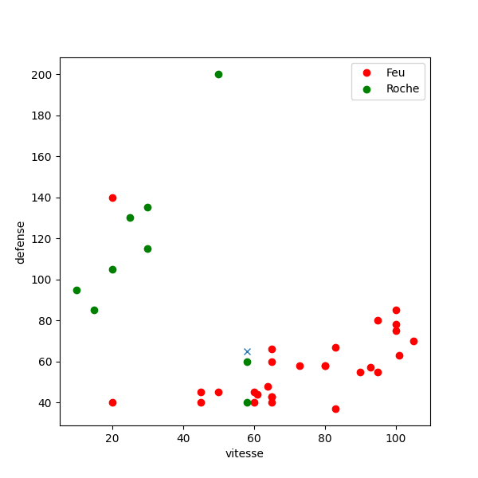
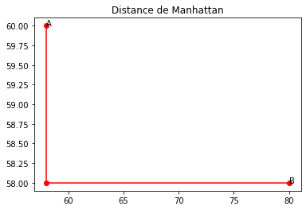
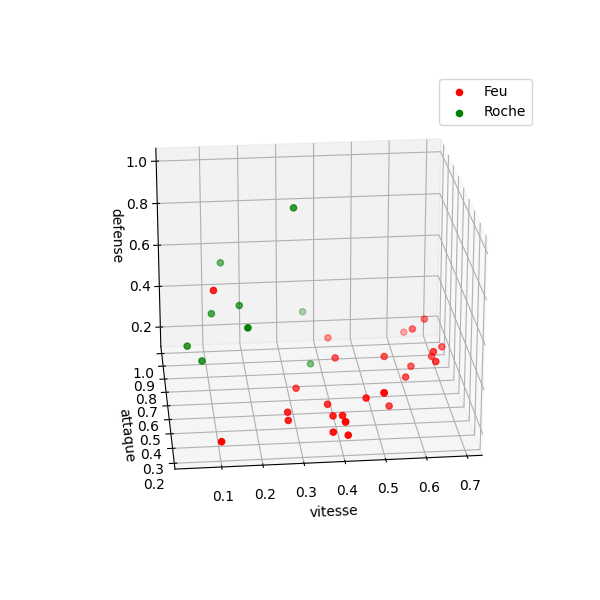

---
title : Cours sur l'algorithme des k plus proches voisins
subtitle: Thème algorithmique
author : Première NSI,  [Lycée du Parc](https://frederic-junier.org/)
numbersections: true
fontsize: 11pt
geometry:
- top=20mm
- left=20mm
- right=20mm
- heightrounded    
--- 
 
<!-- Définition des hyperliens  -->

[Python]: https://docs.python.org/3/tutorial/datastructures.html
[Python-tutor]: http://pythontutor.com/visualize.html#mode=edit

# Crédits {-} 
 
_Ce cours a été construit à partir de plusieurs sources : l'excellent cours de Julien de Villèle dont sont extraits certains passages ;  le  chapitre 13 du manuel NSI de la collection Tortue chez Ellipse,  auteurs : Ballabonski, Conchon, Filliatre, N'Guyen ; les fiches de cours 37 et 38 du Prepabac Première NSI chez Hatier, auteurs : Laurent Signac et Guillaume Connan ; un QCM sur <https://doctools.dgpad.net> réalisé par Alain Busser._


<!-- Définition des hyperliens  -->

# Présentation du problème de classification

:::activite
    
    En guise d'introduction au problème de classification par _l'algorithme des k plus proches voisins_, répondez au QCM réalisé par Alain Busser, qui est proposé à l'adresse <https://link.dgpad.net/dsFN>.
    
:::

Dans ce cours, on considère un exemple modèle constitué de 37 Pokemons  dont on donne ci-dessous une représentation graphique avec  :

* en abscisse leur vitesse
* en ordonnée leur défense
* en couleur leur type : _Feu_ ou _Roche_

:::{.minipage width="0.8\linewidth" center="true"}
    {width="100%"}\
    _Graphique 1 : Pokemons Feu ou Roche avec deux descripteurs_
:::


Les données peuvent être représentées sous forme d'une table contenant 37 enregistrements
ayant cette forme  : 

```python
{'nom': 'Salameche',   'defense': '43',  'vitesse': '65',  'type': 'Feu'}
```

Chaque enregistrement contient ce qu'on appellera pour la suite :

* deux __descripteurs__  `'defense'` et `'vitesse'` qui donnent la position du point,
* une unique __étiquette__ 'type' qui donne la couleur du point.
  
:::remarque
    Les valeurs des descripteurs `'defense'`  et `'vitesse'` sont de type `str` dans l'enregistrement. IL faut donc les convertir en type `int` ou `float` pour placer le point dans un repère. En pratique les enregistrements sont extraits de fichiers textes , comme des fichiers [CSV](https://fr.wikipedia.org/wiki/Comma-separated_values), et les descripteurs peuvent représenter des catégories ('mâle', 'femelle' ...) tout autant que des valeurs numériques. On a donc choisi de garder toutes les valeurs en type `str` et de les convertir selon les besoins de traitement.
:::

:::cours
    Le __problème de classification__ auquel _l'algorithme des k plus proches voisins_ tente d'apporter une réponse est le suivant (les trois formulations sont équivalentes) :
    
    * Un nouveau Pokemon a pour `'vitesse'` 58 et pour `'defense'`  65, quel est son type ?
    * Un nouveau point a pour coordonnées (58 ; 65). Quelle est sa couleur ?
    * Un nouvel enregistrement a pour descripteurs `'vitesse' : 58` et `'defense' : 65`. Quelle est son étiquette ?
    
    Sur le graphique, si on ne considère que le point vert le plus proche (en mesurant à la règle), on peut attribuer l'étiquette 'vert' (type _Roche_)  au nouveau point. Mais si on considère les trois voisins les plus proches , deux sur trois sont rouges et dans ce cas on attribue l'étiquette 'rouge' (type _Feu_). On voit que le nombre de voisins à considérer est important, de plus la distance doit être définie précisément. 
    
    Le paramétrage de l'algorithme peut être  effectué par un humain mais son exécution par un ordinateur   permet  :
    * d'automatiser la réponse,
    * de répondre rapidement à des milliers ou millions de questions du même type,
    * de généraliser à des cas avec plus de deux descripteurs
::: 


# Algorithme des  k plus proches voisins 


:::activite
    Regardez la petite video accessible depuis ce lien : [algo_1_sur_2.gif](algo_1_sur_2.gif)
:::

:::cours
    
    Les données sur lesquelles on applique _l'algorithme des k plus proches voisins_ sont :
    
    * une table d'enregistrements (dictionnaires Python) d'objets dont on connait __l'étiquette / la classification__, nommons la `table_pokemon`. On peut remplacer enregistrement par : point, donnée ou Pokemon dans notre exemple.
    * l'enregistrement   d'une nouvelle donnée dont on cherche __l'étiquette / la classification__, nommons le  `nouveau_pokemon`
    
    Les paramètres de _l'algorithme des k plus proches voisins_ sont :
    
    * Un __entier naturel `k`__, généralement impair et compris entre 3 et 10, qui correspond au nombre de voisins les plus proches qui seront examinés.
    * Une __fonction de distance__ pour mesurer la proximité entre la nouvelle donnée et toutes les  données déjà étiquetées de la table ce qui permettra de sélectionner les `k` plus proches. Cette distance est mesurée  à partir des valeurs de certains descripteurs présents dans les enregistrements, comme `'vitesse'` et `'defense'` dans l'exemple du cours.
    
    
    _L'algorithme des k plus proches voisins_ se déroule ainsi :
    
    1. Pour chaque enregistrement / pokemon dans `table_pokemon`  on calcule la distance entre cet enregistrement et celui de `nouveau_pokemon`. On stocke au fur et à mesure les couples `(distance avec chaque  nouveau_pokemon, étiquette de l'enregistrement / pokemon)` dans un tableau `tab_distance`.
    2. On trie le tableau  `tab_distance` (qui contient des `tuple` `(distance, étiquette)`) dans l'ordre croissant selon le critère de distance.
    3. On extrait les `k` plus petits éléments de `tab_distance` qui correspondent aux `k` plus proches voisins de `nouveau_pokemon` dans un tableau `k_voisins`.
    4. On sélectionne l'étiquette majoritaire dans le tableau `k_voisins` et on l'attribue à `nouveau_pokemon` parce que c'est le choix majoritaire parmi les `k` plus proches voisins.
:::


:::exemple
    
    Détaillons les différentes étapes  de _l'algorithme des k plus proches voisins_  sur notre exemple de Pokemons.
    
    * __Initialisation : chargement et traitement du jeu de données__
      
    On charge le fichier [CSV](https://fr.wikipedia.org/wiki/Comma-separated_values) contenant le jeu de données dans une table (un tableau d'enregistrements qui sont des dictionnaires).
      
    ~~~python
    In [1]: table_pokemons = charger_fichier_entete('./datas/pokemons.csv')
    
    In [2]: table_pokemons[0]
    Out[2]: 
    {'nom': 'Rattata', 'vie': '30',
     'attaque': '56',  'defense': '35',
     'vitesse': '72',  'type': 'Normal'}
    ~~~
    
    On filtre la table pour extraire les Pokemons de type Feu et Roche. Une étape de traitement des données est souvent nécessaire.
    
    ~~~python
    In [3]: table_pokemons_feu_roche = [pok for pok in table_pokemons 
       ...:                    if pok['type'] in ['Roche', 'Feu']]
    
    In [4]: len(table_pokemons_feu_roche)
    Out[4]: 37
    ~~~
    
    * __Étape 1 : calcul des distances__ 
    
    On calcule les distance entre le nouveau Pokemon et tous les Pokemons de la table `table_pokemons_feu_roche`.
    
    ~~~python
    In [5]: nouveau_pokemon = {'vitesse':58, 'attaque' : 120 , 'defense' : 65, 'vie' : 100 }
    
    In [6]: table_pokemons_feu_roche[0] #premier Pokemon de la table
    Out[6]: 
    {'nom': 'Salameche', 'vie': '39',
     'attaque': '52',  'defense': '43',
     'vitesse': '65',  'type': 'Feu'}
    
    In [7]: salameche = table_pokemons_feu_roche[0]
    
    In [8]: distance_euclidienne(nouveau_pokemon, salameche, ['vitesse', 'defense'])
    Out[8]: 23.087
    
    In [9]: tab_distance = table_distance_nouveau(table_pokemons_feu_roche, nouveau_pokemon, distance_euclidienne, 'type',                                      ['vitesse', 'defense'])
    
    In [10]: tab_distance[:4]
    Out[10]: [(18.385, 'Feu'), (22.091, 'Feu'), (21.19, 'Feu'), (44.598, 'Feu')]
    ~~~
    
    * __Étapes 2 et 3 : tri et sélection des k plus proches voisins__  
    
    On fixe le paramètre, on trie dans l'ordre croissant le tableau `tab_distance` suivant le critère de distance et on extrait les `k` plus proches voisins.
    
    ~~~python
    In [11]: k_voisins = trier_puis_extraire(tab_distance, 5)
    
    In [12]: k_voisins
    Out[12]: ['Roche', 'Feu', 'Feu', 'Feu', 'Feu']
    ~~~
    
    * __Étape  4 : sélection de l'étiquette majoritaire parmi les k plus proches voisins__
    
    ~~~python
    In [19]: element_majoritaire(k_voisins)
    Out[19]: 'Feu'
    ~~~~
    
    On peut rassemble toutes les fonctions précédentes en une seule qui renvoie l'étiquette majoritaire parmi les `k` plus proches voisins.
    
    ~~~python
    def etiquetage_knn(table, nouveau, etiquette, tab_descripteur, k,
                       distance = distance_euclidienne):    
        tab_distance = table_distance_nouveau(table, nouveau, distance, etiquette, tab_descripteur)
        k_voisins = trier_puis_extraire(tab_distance, k)
        voisin_majoritaire = element_majoritaire(k_voisins)
        return voisin_majoritaire
    ~~~
    
    On peut vérifier que cela donne le même résultat.
    
    ~~~python
    In [20]: etiquetage_knn(table_pokemons_feu_roche, nouveau_pokemon, 'type', ['vitesse', 'defense'], 5)
    Out[20]: 'Feu'
    ~~~
    
    
:::


# Choix des paramètres et limites de l'algorithme

## Le choix de la distance


:::{.minipage width="0.5\linewidth" center="true"}
    \
    &
    \
:::

_Graphique  2 : distances dans le plan_

:::cours
    Considérons un nouveau Pokemon et un Pokemon déjà connu  dans une table :
    
    ~~~python
    In [3]: nouveau_pokemon
    Out[3]: {'vitesse': 58, 'attaque': 120, 'defense': 65, 'vie': 100}
    
    In [4]: table_pokemons_feu_roche[1]
    Out[4]: 
    {'nom': 'Reptincel', 'vie': '58',  'attaque': '64',  'defense': '58',  'vitesse': '80',
     'type': 'Feu'}
    ~~~~
    
    * Si on caractérise chaque Pokemon par deux descripteurs `'vitesse'` et `'defense'`, on peut les représenter dans le plan par les points A de coordonnées $(58, 65)$  et B de coordonnées $(80, 58)$. On peut calculer la distance AB de plusieurs façons, comme par exemple :
       * La __distance euclidienne__ qui correspond à celle de la règle graduée :  
          $AB=\sqrt{(x_{B}-x_{A})^{2}+(y_{B}-y_{A})^{2}}=\sqrt{(80-58)^{2}+(58-65)^{2}} \approx 23,087$
       * La __distance de Manhattan__ qui correspond à la longueur du chemin parcouru pour aller de $A$ à $B$ en se déplaçant le long des arêtes d'un quadrillage généré par un repère orthonormé du plan, comme dans le plan d'une ville où les rues se coupent à angle droit :
           $AB=\vert x_{B}-x_{A} \vert + \vert y_{B}-y_{A} \vert =\vert 80 - 58 \vert + \vert 58 - 65 \vert = 22 + 7 = 29$
    
    * Si on caractérise chaque Pokemon par trois descripteurs `'vitesse'`, `'defense'` et `'attaque'` on peut les représenter dans l'espace  par les points A de coordonnées $(58, 65, 120)$  et B de coordonnées $(80, 58, 64)$. On peut calculer la distance AB de plusieurs façons, comme par exemple en notant $z$ la troisième coordonnée :
       * La __distance euclidienne__ qui correspond à celle de la règle graduée :  
          $AB=\sqrt{(x_{B}-x_{A})^{2}+(y_{B}-y_{A})^{2} + (z_{B}-z_{A})^{2}}=\sqrt{(80-58)^{2}+ (58-65)^{2} +   (120 - 64)^{2}} \approx 60,572$
       * La [distance de Manhattan](https://fr.wikipedia.org/wiki/Distance_de_Manhattan) qui correspond à la longueur du chemin parcouru pour aller de $A$ à $B$ en se déplaçant le long des arêtes d'un quadrillage généré par un repère orthonormé du plan, comme dans le plan d'une ville où les rues se coupent à angle droit :
           $AB=\vert x_{B}-x_{A} \vert + \vert y_{B}-y_{A} \vert =\vert 80 - 58 \vert + \vert 58 - 60 \vert  + \vert  120 - 64  \vert = 22 + 7 + 56 = 85$
    
    * On peut généraliser les calculs de distances précédents à 4, 5 ou n descripteurs.
    
    L'ensemble des k plus proches voisins dépend du choix de la distance qui s'effectue en fonction du jeu de données. 
    
    De plus, il faut prêter attention aux différences d'échelles entre les descripteurs : un écart de 50 n'a pas le même sens sur  une `'vitesse'`   mesurée sur une échelle de 0 à 1000 et sur une `'defense'`  mesurée sur une échelle de 0 à 100. Il peut être intéressant, dans la phase de traitement des données, de les normaliser en ramenant chaque valeur de descripteur dans l'intervalle [0;1] avec le rapport $\frac{\text{valeur}-\text{valeurMin}}{\text{valeurMax}-\text{valeurMin}}$.
:::

Voici une représentation dans l'espace du jeu de données des 37 Pokemons _Roche_ et _Feu_ avec trois descripteurs `'vitesse'`, `'defense'` et `'attaque'`. L'ajout d'un descripteur peut permettre d'améliorer la classification en séparant plus nettement les familles de points selon leur étiquette.

:::{.minipage width="0.8\linewidth" center="true"}
    {width="100%"}\
    _Graphique 3 : Pokemons Feu ou Roche avec trois descripteurs_
:::


:::exercice
    Dans le plan muni d'un repère orthonormé on a représenté cinq points d'un jeu de données étiquetés :
    
    * trois points d'étiquette 'rond' : A, B et C
    * deux points d'étiquette 'croix' : E et F
    
    On  considère un nouveau point  D sans étiquette.
    
    
    1. Déterminer les trois points les plus proches de D avec la __distance euclidienne__.
    2. Déterminer les trois points les plus proches de D avec la __distance de Manhattan__.
    3. Quelle est l'étiquette de D si on applique l'algorithme des k plus proches voisins avec k = 3 et la __distance euclidienne__ ? et avec k = 3 et la __distance de Manhattan__ ?
    
    {width="70%"}\
    
    
:::

:::exercice
    Les distances euclidienne ou de Manhattan s'appliquent à des  descripteurs qui prennent des valeurs numériques continues.
    
    La [distance de Hammming](https://fr.wikipedia.org/wiki/Distance_de_Hamming) s'applique à des descripteurs qui sont  des séquences de symboles comme des chaînes de caractères ou des suites de bits 0 ou 1 et prend pour valeur le nombre de symboles différents entre deux séquences.
    
    Par exemple, on a  `distance_hamming('rat', 'raz') = 1` ,  `distance_hamming('rat', 'rater') = 2`,  `distance_hamming('101', '011') = 2` et `distance_hamming('1010', '101') = 1`.
    
    Écrire en Python une fonction d'en-tête `distance_hamming(chaine1, chaine2)` qui renvoie la distance de Hamming entre deux chaînes de caractères.
:::

## Le choix du paramètre `k`


:::activite
    Regardez la petite video accessible depuis ce lien : [algo_2_sur_2.gif](algo_2_sur_2.gif)
:::

:::cours
    
    On reprend l'exemple initial du jeu de données de 37 Pokemons _Roche_ et _Feu_ caractérisés par les deux descripteurs `'vitesse'` et  `'defense'` et d'un nouveau Pokemon de `'vitesse' : 58` et `'defense' : 65` représentés sur le graphique 1.
    
    On donne ci-dessous  les étiquettes attribués par  _l'algorithme des k plus proches voisins_ avec k variant entre 1 et 9.
    
    On observe la sensibilité aux perturbations locales pour les petites valeurs de k : les des deux points  les plus proches sont verts, de type _Roche_ , mais les points dans un voisinage plus large sont majoritairement rouges, de type _Feu_.  
    
    D'un autre côté, une valeur de k trop grande prend en compte des points éloignés et la classe majoritaire globalement finit par s'imposer.
    
    En général, on choisit une valeur de k entre 3 et 10 et plutôt un entier impair (pourquoi d'après vous ?)
    
    ~~~python
    In [30]: nouveau_pokemon = {'vitesse':58, 'attaque' : 120 , 'defense' : 65, 'vie' : 100 }
        ...: for k in range(1, 11):
        ...:     print(f"k = {k}, etiquette = {etiquetage_knn(table_pokemons_feu_roche, nouveau_pokemon, 'type', ['vitesse', 'defense'], k)}")
        ...:     
    k = 1, etiquette = Roche
    k = 2, etiquette = Roche
    k = 3, etiquette = Feu
    k = 4, etiquette = Feu
    k = 5, etiquette = Feu
    k = 6, etiquette = Feu
    k = 7, etiquette = Feu
    k = 8, etiquette = Feu
    k = 9, etiquette = Feu
    k = 10, etiquette = Feu
    ~~~
    
:::


## Les limites de l'algorithme

:::cours
    
    _L'algorithme des k plus proches voisins_ permet de répondre à un __problème de classification__ pour tout type de données mais il faut être conscient de ses limites :
    
    *  il faut calculer les distances entre une nouvelle donnée et toutes celles du jeu de données ce qui implique une complexité au moins linéaire en temps, ce qui n'est pas tolérable pour des jeux de données de grande taille ou des applications en temps réel
    *  la qualité de la prédiction repose sur l'hypothèse que les données proches pour la distance choisie sont similaires à la nouvelle donnée
    *  la qualité du jeu de données est cruciale comme pour tout algorithme de classification.
    
:::


# Histoire de l'intelligence artificielle et des algorithmes d'apprentissage

:::cours
    _L'algorithme des k plus proches voisins_ est un exemple simple d'algorithme de classification par apprentissage (_machine learning_): il exploite un jeu de données connu pour apporter une information, plausible mais pas forcément exacte sur une nouvelle donnée. On 
    
    Cette famille d'algorithmes est rattachée à la branche de l'informatique dénommée __intelligence artificielle__ qui peut être définie comme _la conception des agents rationnels, autonomes et adaptatifs pour résoudre des problèmes « comme ou mieux » que
    ne le ferait un être humain_.
    
    L'__intelligence artificielle__  est apparue dès les débuts de l'informatique dans les années 1950, le mythe d'une créature artificielle intelligente étant un classique de la littérature (Golem, Frankenstein ...). Après avoir connu, un _hiver_ pendant les années 1980-1990, un renouveau important a lieu depuis les années 2000. Le développement d'idées anciennes comme les réseaux de neurones a été favorisé par une accélération des performances matérielles (GPU) et des volumes de données disponibles (essor du web). Les réseaux de neurones profonds  (_deep learning_) rendent possibles des applications proches de certaines aptitudes considérées auparavant comme caractéristiques de l'humain: reconnaissance d'image, du langage, prise de décision ...
:::

:::exercice
    Compléter la frise ci-dessous avec ces événements marquants de l'histoire de __l'intelligence artificielle__  qui sont donnés dans le désordre :
    
    * test de Turing 
    * victoire d'Alpha-Go sur le meilleur joueur humain de jeu de Go
    * premier neurone artificiel imaginé par Mc Culloch et Pitts
    * victoire de Watson (IBM) sur les meilleurs joueurs humains au jeu Jeopardy
    * victoire de Deep Blue (IBM) sur le champion du monde d'échec Gary Kasparov
    * invention du perceptron par Frank Rosenblatt
    * conférence de Darmouth
    * prix Turing décerné à Yann Le Cun pour ses travaux sur le Deep Learning
    
:::

:::{.minipage width="\linewidth" center="true"}
    {width="100%"}\
    _Graphique 4 : histoire de l'intelligence artificielle_
:::


# Synthèse

:::memo
    
    _L'algorithme des k plus proches voisins_ a pour but de  classifier une nouvelle donnée en lui attribuant une étiquette à partir des étiquettes  déjà connues d'un jeu de données similaires.
    
    L'algorithme n'apporte pas une réponse exacte mais une prédiction dont la qualité dépend du jeu de données, de la distance utilisée pour mesurer  la similarité entre deux données et du nombre k de voisins les plus proches parmi lesquels l'étiquette  majoritaire sera choisie.
    
    La dernière décennie a connu un essor spectaculaire d'algorithmes e classification par apprentissage bien plus performants et perfectionnés qui s'appuient sur des jeux de données gigantesques et apportent des réponses à des questions comme :
    
    - Quelle est la classe de cet objet sur cette photo ? une voiture ? une moto ? une poussette ?
    - Quel est, au vu de ses données médicales, le diagnostic que l'on peut faire sur ce patient ? malade ou pas ?
    - Quel est, au vu de sa  consommation précédente, le profil de ce consommateur streaming video ? quelles séries peut-on lui suggérer  ?
    - Quel est, au vu de son dossier administratif, le profil de ce contribuable ? fraudeur ou pas ?
    
    
:::
