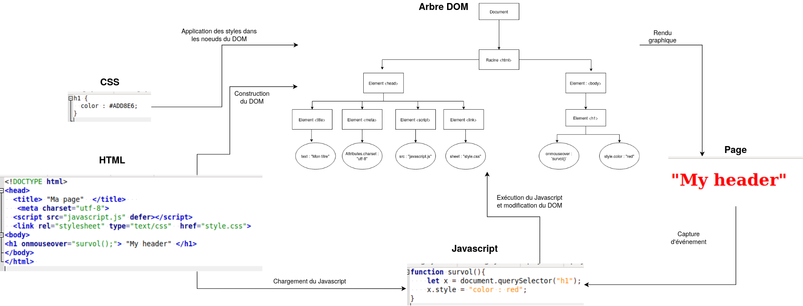

---
title : Web et Interaction Homme Machine, programmation côté client
author : Première NSI,  [Lycée du Parc](https://frederic-junier.org/)
numbersections: true
fontsize: 11pt
geometry:
- top=20mm
- left=20mm
- right=20mm
- heightrounded    
--- 
 
# Crédits {-} 

_Ce cours est largement inspiré du chapitre 29 du manuel NSI de la collection Tortue chez Ellipse,  auteurs : Ballabonski, Conchon, Filliatre, N'Guyen. J'ai également consulté le prepabac Première NSI de Guillaume Connan chez Hatier,  la documentation en ligne de la fondation Mozilla [https://developer.mozilla.org/fr/docs/Apprendre/JavaScript](https://developer.mozilla.org/fr/docs/Apprendre/JavaScript) et le tutoriel de w3schools [https://www.w3schools.com/js/default.asp](https://www.w3schools.com/js/default.asp)._

<!-- Définition des hyperliens  -->

[URL]:https://developer.mozilla.org/fr/docs/Glossaire/URL

[HTTP]:https://developer.mozilla.org/fr/docs/Glossaire/HTTP

[HTML]:https://developer.mozilla.org/fr/docs/Glossaire/HTML

[Tim Berners-Lee]:https://interstices.info/les-debuts-du-web-sous-loeil-du-w3c/

[Robert Caillau]:https://fr.wikipedia.org/wiki/Robert_Cailliau

[CERN]:https://fr.wikipedia.org/wiki/Organisation_europ%C3%A9enne_pour_la_recherche_nucl%C3%A9aire 

[IETF]:https://developer.mozilla.org/fr/docs/Glossaire/IETF

[TCP]:https://developer.mozilla.org/fr/docs/Glossaire/TCP

[IP]:https://developer.mozilla.org/fr/docs/Glossaire/IP_Address

[Javascript]:https://developer.mozilla.org/fr/docs/Glossaire/JavaScript

[CSS]:https://developer.mozilla.org/fr/docs/Glossaire/CSS

[DNS]:https://developer.mozilla.org/fr/docs/Glossaire/DNS  

[HTTPS]:https://developer.mozilla.org/fr/docs/Glossaire/https

[PHP]:https://developer.mozilla.org/fr/docs/Glossaire/PHP

[Python]:https://docs.python.org/3.7/library/cgi.html

[POST]:https://developer.mozilla.org/fr/docs/Web/HTTP/M%C3%A9thode/POST

[GET]:https://developer.mozilla.org/fr/docs/Web/HTTP/M%C3%A9thode/GET

[certificat]:https://developer.mozilla.org/fr/docs/Glossaire/Certificat_num%C3%A9rique

[Java]:https://developer.mozilla.org/fr/docs/Glossaire/Java

[CMS]:https://developer.mozilla.org/fr/docs/Glossaire/CMS

[Node.js]:https://developer.mozilla.org/fr/docs/Glossaire/Node.js

[Apache]:https://doc.ubuntu-fr.org/apache2

[Nginx]:https://doc.ubuntu-fr.org/nginx

[MySQL]:https://doc.ubuntu-fr.org/mysql

[MariaDb]:https://doc.ubuntu-fr.org/mariadb

[Lamp]:https://doc.ubuntu-fr.org/lamp

[Bash]:https://doc.ubuntu-fr.org/bash

[C]:https://fr.wikipedia.org/wiki/C_(langage)

[Flask]:https://flask.palletsprojects.com/en/1.1.x/

[Framework]:https://fr.wikipedia.org/wiki/Framework

[MVC]:https://developer.mozilla.org/fr/docs/Glossaire/MVC

[Jinja]:https://jinja.palletsprojects.com/en/2.11.x/

[DOM]:https://developer.mozilla.org/fr/docs/Glossaire/DOM

[API]:https://developer.mozilla.org/fr/docs/Glossaire/API

[Netscape]:https://fr.wikipedia.org/wiki/Netscape_Navigator

[programmation événementielle]:https://fr.wikipedia.org/wiki/Programmation_%C3%A9v%C3%A9nementielle

[Kotlin]:https://fr.wikipedia.org/wiki/Kotlin_(langage)

# [Javascript][Javascript] et la programmation événementielle côté client

:::cours
Dans le chapitre précédent, on a présenté des exemples de pages Web __dynamiques__ générées par des programmes en [PHP][PHP] ou [Python][Python]. Chaque mise à jour de la page nécessite donc un nouveau cycle requête/réponse entre le client et le serveur. C'est indispensable s'il s'agit de modifier l'état d'une ressource côté serveur (une base de données par exemple), mais  les changements peuvent n'être que temporaires et n'affecter que des éléments de la page côté client. C'est le cas de l'exemple déjà traité en [PHP][PHP]  de la conversion d'unité pour une mesure de température.

[Javascript][Javascript] est un langage interprété qui répond à ce besoin  qui s'exécute dans le navigateur du client. [Javascript][Javascript] s'est imposé depuis son apparition en  1995 dans le navigateur [Netscape][Netscape] comme le principal langage de développement Web en _frontend_ (côté client) et depuis une dizaine d'années, sa variante [Node.js][Node.js] concurence les langages de développement _backend_ (côté serveur) comme [PHP][PHP] ou [Python][Python].

Une page Web moderne, reçue par un client,  comporte  au moins trois composants logiciels : 

* [HTML][HTML] pour la structure du document.
* [CSS][CSS] pour le paramétrage de l'apparence des éléments et leur positionnement.
* [Javascript][Javascript] pour la définition de programmes qui vont réagir à des événements déclenchés par l'utilisateur de la page et modifier la structure de données de la page  ( éléments [HTML][HTML] et styles [CSS][CSS]) à travers l'[API][API] ^[Note : [API][API] est l'acronyme d'Application Programming Interface] nommée [DOM][DOM] ^[Note : [DOM][DOM] est l'acronyme de Document Object Model].  Le [DOM][DOM] est une représentation de l'ensemble de la structure de la page Web sous la forme d'un arbre : les noeuds sont les éléments [HTML][HTML] et ils ont une liste de propriétés : contenu, style, événements associés ... L'inspecteur des outils de développement, accessibles avec la touche  `F12` dans un   navigateur, permet de visualiser et modifier les propriétés des éléments du [DOM][DOM].

L'environnement d'exécution d'un code [Javascript][Javascript] est confiné à l'onglet de la  page Web où il est chargé. Pour des raisons de sécurité il ne doit pas interagir avec d'autres pages ou des  ressources du poste client. Par ailleurs, si on recharge la page auprès du serveur, l'environnement  [Javascript][Javascript] est réinitialisé et  les modifications de la page effectuées par un code [Javascript][Javascript] ne sont pas répercutées sur la page source disponible sur le serveur.

Le schéma ci-dessous illustre le fonctionnement du [Javascript][Javascript] qui correspond à un paradigme de [programmation événementielle][programmation événementielle].
:::

 

#  Premiers pas dans la console [Javascript][Javascript]

:::cours

Compléter ce tableau sur les opérateurs en [Javascript][Javascript]  à partir de la page <https://developer.mozilla.org/fr/docs/Web/JavaScript/Guide/Expressions_et_Op%C3%A9rateurs>.

Opérateurs|Description
:--:|:--:
`=`|
`*`|
`/`|
`**`|
`==` ou `===` |
`!=` ou `!===`|
`&&` |
`||` |
`!`|

:::

:::exercice
Ouvrir un nouvel onglet dans un navigateur Web.

1. Ouvrir la console [Javascript][Javascript] dans la fenêtre  des outils de développement avec `F12` ou `CTRL + SHIFT + K` sous Firefox. On va exécuter de façon interactive, une séquence d'instructions [Javascript][Javascript] pour présenter quelques constructions élémentaires et propriétés du langage.  Chaque instruction pourra modifier l'état du [DOM][DOM] et donc le rendu graphique de la page Web.

2. On commence par  quelques manipulations de variables et calculs :
   
  ~~~javascript
  >>> let a = 1
  undefined
  >>> (a * 3 + 1) ** 2 / 5 - 1
  2.2
  >>> (a * 3 + 1) ** 2 // commentaire !
  16
  >>> let b = "Hello"
  undefined
  >>> b + " World"
  "Hello World"
  >>> typeof(a)
  "number"
  >>> typeof(b)
  "string"
  >>> a = b + a
  "Hello1"
  >> typeof(a)
  "string"
  ~~~

   * Barrer les propositions fausses :  [Javascript][Javascript]  est  à typage _(fort | faible)_ et _(dynamique | statique)_ et une variable égale à 5  se déclare avec _(let a = 5 | a = 5)_.

3. Examinons un exemple  avec une fonction, une structure conditionnelle et une boucle. Dans la console, passer en mode éditeur multiligne avec `CTRL + B` et saisir le code ci-dessous :
~~~javascript
function valabs(x){
  if (x < 0){
    return -x;
  }
  else {
    return x;
  }
}

for (let i = -4; i < 5; i = i + 1){
  if (valabs(i) > 2){
    alert(i);
  }
  else {
    console.log(i);
  }
}
~~~

   * Barrer les propositions fausses : en [Javascript][Javascript], les blocs d'instructions sont délimités par _(l'indentation | des accolades)_,  les fonctions sont déclarées avec le mot clef _(def | function)_ et une boucle inconditionnelle sur les entiers entre 1 et 10 commence par l'instruction _( for k in range(1, 11)  | for (let k = 1; k < 11; k = k + 1) )_
   * Barrer les propositions fausses : la fonction `alert` affiche son paramètre dans _(une fenêtre pop-up | la console)_ tandis que  la fonction `console.log` affiche son paramètre dans _(une fenêtre pop-up | la console)_.

:::

:::exercice
[Javascript][Javascript] dispose de toutes les constructions permettant de progammer les mêmes algorithmes qu'en [Python][Python], mais s'il a été inventé par les développeurs de  [Netscape][Netscape] c'est pour manipuler les éléments [HTML][HTML], à travers l'interface du  [DOM][DOM]. Il existe plusieurs façons de  capturer un élément [HTML][HTML], la plus simple s'il s'agit d'un élément particulier est [l'accès par son identifiant unique `id`](https://www.w3schools.com/js/js_htmldom_methods.asp) (à condition qu'il soit défini).  
Ouvrir un navigateur Web et charger la page [https://frederic-junier.org/NSI/sandbox/bac.html](https://frederic-junier.org/NSI/sandbox/bac.html). Le code source [HTML][HTML] de la page est donné ci-dessous :

~~~html
<!DOCTYPE html>
<head>
  <title> "Bac à sable"  </title>
   <meta charset="utf-8">
<body>
<ul id="langages">
    <li> HTML </li>
    <li> CSS </li>
</ul>
</body>
</html>
~~~

1. Saisir successivement les instructions ci-dessous dans la console,  observer ce qu'il se passe dans la page étape par étape.  Caractériser le rôle de chaque instruction puis saisir des instructions qui permettent de modifier le contenu [HTML][HTML] et le style du second item  de la liste.
  
  ~~~javascript
  >>> let list = document.getElementById("langages")
  undefined
  >>> list.style.color = "red"
  "red"
  >>> let item1 = list.children[0]
  undefined
  >>> item1
  <li>
  >>> item1.innerHTML = 'HTML5'
  "HTML5"
  ~~~

  \

2. Saisir successivement les instructions ci-dessous dans la console,  observer ce qu'il se passe dans la page étape par étape.  Caractériser le rôle de chaque instruction puis saisir des instructions qui permettent de rajouter un quatrième item à la liste dont le contenu est [Kotlin][Kotlin].

  ~~~javascript
  >>> let item3 = document.createElement("li")
  undefined
  >>> list.appendChild(item3)
  <li>
  >>> item3.innerHTML = "Javascript"
  "Javascript"
  ~~~

3. Passer la console en mode mutliligne avec `CTRL + B` puis saisir  et exécuter le code ci-dessous. Survoler la liste ou cliquer dessus  avec la souris et observer ce qui se passe dans la page. Caractériser le rôle de chaque instruction en vous appuyant sur la lecture de l'article [https://developer.mozilla.org/fr/docs/Web/API/GlobalEventHandlers/onclick](https://developer.mozilla.org/fr/docs/Web/API/GlobalEventHandlers/onclick).

  ~~~javascript
  function apparition(){
    list.style.visibility = "visible";
  }

  function disparition(){
    list.style.visibility = "hidden";
  }

  list.onmouseover = disparition ;  
  //le symbole ; est le séparateur d'instruction en Javascript
  list.onmouseleave = apparition ;
  list.onclick = function() { alert("Clic !") ; } ;  //définition d'une fonction anonyme
  ~~~

4. Recharger la page avec `F5`. L'environnement [Javascript][Javascript] a-t-il été conservé ?
:::

# Approfondissement : rédaction de scripts et gestionnaires d'événements

:::exemple

Ouvrir un navigateur Web et accéder à la page <https://frederic-junier.org/NSI/sandbox/compteur-clic.html>.

On donne ci-dessous le code source de la page Web.

~~~html
<!DOCTYPE html>

<html lang="fr">

<head><!-- Début en-tête -->
  <title>Compteur de clics </title>
  <meta charset="utf-8">
  <!-- Début script JS --> 
    <!-- Fin script JS -->
</head><!-- Fin en-tête -->
 
<body><!-- Début corps -->   
  <h1>Compteur de clics en Javascript </h1>
    <button onclick="suivant();">Clic !</button>
     
    0
     
    <button onclick="reinitialiser();">Réinitialiser !</button>
</body><!-- Fin corps -->

</html> 
~~~

1. On peut interagir avec la page en cliquant sur le bouton _Clic !_ puis réinitialiser le compteur en cliquant sur  le bouton _Réinitialiser_.
2. Ouvrir l'onglet inspecteur dans la fenêtre des outils de développement et afficher la structure de la page comme ci-dessous.

   * Repérer l'étiquette `event` attachée au bouton de contenu _Clic !_ et déplier son contenu.

   \ 

   * Pour cet élément `button`, l'attribut `onclick="suivant()"` a défini une fonction [Javascript][Javascript]  `function onclick(event) {suivant();}` qui prend en paramètre un __événement utilisateur__ (ici un click) et réagit en  appelant la fonction `suivant`. La fonction `suivant` est appelée __gestionnaire d'événement__.
   * Le code de la fonction `suivant` se trouve dans la balise `
     ~~~

     L'attribut `src` donne le chemin vers le fichier contenant le code [Javascript][Javascript] et l'attribut `defer` précise que le chargement du [Javascript][Javascript] doit se faire après  que la page [HTML][HTML] soit totalement chargée. En effet, [Javascript][Javascript] peut modifier la page à travers l'interface [DOM][DOM], donc il faut ordonnancer le chargement des différentes ressources. Des anciennes pratiques recommandaient ainsi de placer les balises `
    </html>
    ~~~

    Lorsque l'on clique sur le bouton, l'action déclenchée par `maFonction()` est définie :
     * Réponse A : dans le fichier HTML seul
     * Réponse B : dans le fichier `style.css`
     * Réponse C : dans une bibliothèque prédéfinie du navigateur
     * Réponse D : dans le fichier `script.js`

7. Voici un extrait d'une page HTML :

    ~~~html
    

    <form>
    Nombre 1 : <input name="n1" value="30">  
    Nombre 2 : <input name="n2" value="10">  
    <input type="button" value="Somme"
    onclick="sommeNombres(this.form)">
    </form>
    ~~~

    Quand l'utilisateur clique sur le bouton Somme, le calcul de la fonction `sommeNombre()` se fait :
    * Réponse A : uniquement dans le navigateur
    * Réponse B : uniquement sur le serveur qui héberge la page
    * Réponse C : à la fois dans le navigateur et sur le serveur
    * Réponse D : si le calcul est complexe, le navigateur demande au serveur de faire le calcul

8. On considère cet extrait de fichier HTML représentant les onglets d'une barre de navigation :

    ~~~javascript
    function BoutonGris() {

    var btn = document.createElement(\"BUTTON\");

    btn.innerHTML = \"Annulation\";

    document.getElementById(\"DIV\").appendChild(btn);

    }
    ~~~

   * Réponse A : elle remplace un élément DIV par un bouton
   * Réponse B : elle annule l'élément BUTTON
   * Réponse C : elle crée un bouton comportant le texte "Annulation"
   * Réponse D : elle recherche le bouton "BUTTON" et crée une copie appelée "btn"

:::

"](images/types.png "[XKCD 1537 : Types](https://xkcd.com/1537/)"){width=25%}