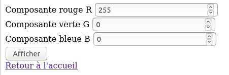
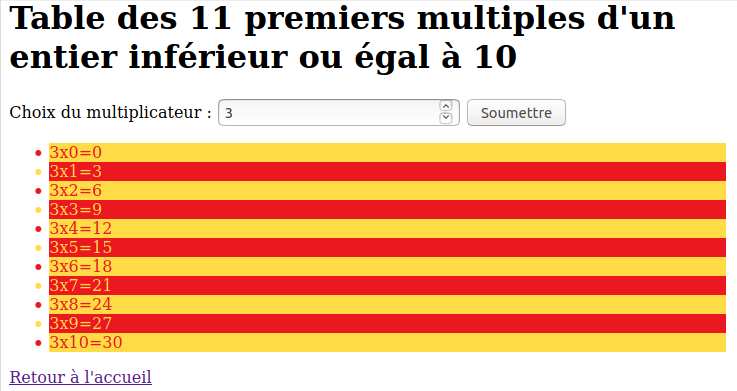
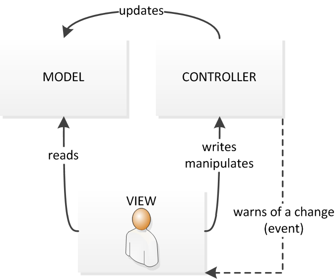
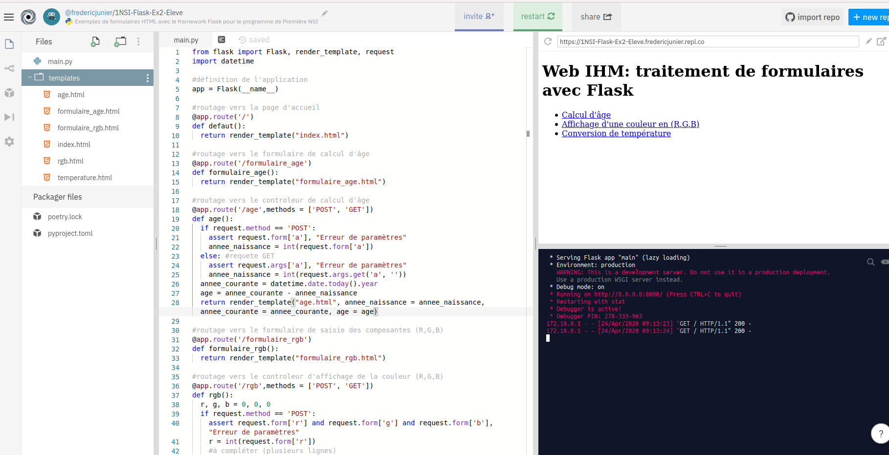

---
title : Web et Interaction Homme Machine, programmation côté serveur
author : Première NSI,  [Lycée du Parc](https://frederic-junier.org/)
numbersections: true
fontsize: 11pt
geometry:
- top=20mm
- left=20mm
- right=20mm
- heightrounded    
--- 
 
# Crédits {-} 
 
_Ce cours est largement inspiré du chapitre 29 du manuel NSI de la collection Tortue chez Ellipse,  auteurs : Ballabonski, Conchon, Filliatre, N'Guyen. J'ai également consulté le prepabac Première NSI de Guillaume Connan chez Hatier,  le cours de [Romain Janvier](http://nsi.janviercommelemois.fr/), le tutoriel PHP de [https://www.w3schools.com/php/default.asp](https://www.w3schools.com/php/default.asp)_ et la documentation du module [Flask](https://flask.palletsprojects.com/en/1.1.x/) de Python.

<!-- Définition des hyperliens  -->

[URL]:https://developer.mozilla.org/fr/docs/Glossaire/URL

[HTTP]:https://developer.mozilla.org/fr/docs/Glossaire/HTTP

[HTML]:https://developer.mozilla.org/fr/docs/Glossaire/HTML

[Tim Berners-Lee]:https://interstices.info/les-debuts-du-web-sous-loeil-du-w3c/

[Robert Caillau]:https://fr.wikipedia.org/wiki/Robert_Cailliau

[CERN]:https://fr.wikipedia.org/wiki/Organisation_europ%C3%A9enne_pour_la_recherche_nucl%C3%A9aire 

[IETF]:https://developer.mozilla.org/fr/docs/Glossaire/IETF

[TCP]:https://developer.mozilla.org/fr/docs/Glossaire/TCP

[IP]:https://developer.mozilla.org/fr/docs/Glossaire/IP_Address

[Javascript]:https://developer.mozilla.org/fr/docs/Glossaire/JavaScript

[CSS]:https://developer.mozilla.org/fr/docs/Glossaire/CSS

[DNS]:https://developer.mozilla.org/fr/docs/Glossaire/DNS  

[HTTPS]:https://developer.mozilla.org/fr/docs/Glossaire/https

[PHP]:https://developer.mozilla.org/fr/docs/Glossaire/PHP

[Python]:https://docs.python.org/3.7/library/cgi.html

[POST]:https://developer.mozilla.org/fr/docs/Web/HTTP/M%C3%A9thode/POST

[GET]:https://developer.mozilla.org/fr/docs/Web/HTTP/M%C3%A9thode/GET

[certificat]:https://developer.mozilla.org/fr/docs/Glossaire/Certificat_num%C3%A9rique

[Java]:https://developer.mozilla.org/fr/docs/Glossaire/Java

[CMS]:https://developer.mozilla.org/fr/docs/Glossaire/CMS

[Node.js]:https://developer.mozilla.org/fr/docs/Glossaire/Node.js

[Apache]:https://doc.ubuntu-fr.org/apache2

[Nginx]:https://doc.ubuntu-fr.org/nginx

[MySQL]:https://doc.ubuntu-fr.org/mysql

[MariaDb]:https://doc.ubuntu-fr.org/mariadb

[Lamp]:https://doc.ubuntu-fr.org/lamp

[Bash]:https://doc.ubuntu-fr.org/bash

[Flask]:https://flask.palletsprojects.com/en/1.1.x/

[Framework]:https://fr.wikipedia.org/wiki/Framework

[MVC]:https://developer.mozilla.org/fr/docs/Glossaire/MVC

[Jinja]:https://jinja.palletsprojects.com/en/2.11.x/

[DOM]:https://developer.mozilla.org/fr/docs/Glossaire/DOM

[API]:https://developer.mozilla.org/fr/docs/Glossaire/API

[Netscape]:https://fr.wikipedia.org/wiki/Netscape_Navigator

[programmation événementielle]:https://fr.wikipedia.org/wiki/Programmation_%C3%A9v%C3%A9nementielle

[Kotlin]:https://fr.wikipedia.org/wiki/Kotlin_(langage)

# Développement côté serveur en PHP

## Site Web dynamique

:::cours
[PHP][PHP] est un langage interprété qui s'exécute sur un serveur Web. Lorsque le serveur reçoit les données d'un formulaire d'un client, il peut les transmettre à un script [PHP][PHP] qui pourra les utiliser pour modifier une base de données ou générer à la volée le contenu [HTML][HTML] qui sera retournée au client.

Une page Web est dite __dynamique__ si son contenu dépend du client qui la demande et de son  contexte (temps, espace, plateforme).
Par opposition, une page Web est __statique__ si son contenu est le même quel que soit le client et le contexte.

Un __site Web dynamique__ s'appuie sur trois composants : un langage interprété comme [PHP][PHP], [Python][Python] ou [Node.js][Node.js], un serveur Web comme [Apache][Apache] ou [Nginx][Nginx] et un système de gestion de bases de données comme [MySQL][MySQL] ou [MariaDb][MariaDb].

[PHP][PHP] est souvent associé avec [Apache][Apache] et [MysSQL][MySQL] pour former la pile [Lamp][Lamp] nécessaire pour accueillir un __site Web dynamique__ comme un [CMS][CMS] de type Wordpress ou Drupal.

Les fichiers [PHP][PHP] portent l'extension `.php` et la syntaxe du langage s'inspire de celles de [Bash][Bash] et [Java][Java], en particulier les blocs sont délimités par des accolades, chaque instruction doit se terminer par un symbole `;` et chaque nom de variable commence par le symbole `$`.

On donne ci-dessous un exemple de code [PHP][PHP], exécutable à partir de l'[URL] [http://frederic-junier.org/NSI/sandbox/heure.php](http://frederic-junier.org/NSI/sandbox/heure.php).

Pour générer une page Web dynamiquement, le code [PHP][PHP] peut être  inséré directement dans du code [HTM][HTML], à l'intérieur de balises `<?php` et `?>`. Les commentaires peuvent être placés entre deux symboles `/*` et `*/`.

~~~php
<!DOCTYPE html>

<html lang="fr">

<head>
  <title>Affichage de l'heure avec PHP </title>
  <meta charset="utf-8">    
</head>

<body>

   <h1> Affichage de l'heure avec PHP </h1>
   
   
 Il est : <?php echo date("H:i:s"); /* commentaire  */  ?>  

</body>
</html> 
~~~
:::

## Un premier exemple

:::exemple

Ouvrir dans un navigateur Web la page <https://repl.it/@fredericjunier/1NSI-PHP-Ex1-Eleve>.

La page s'ouvre sur un environnement de programmation en [PHP][PHP] sur la plateforme [https://repl.it](https://repl.it). Un serveur [Apache][Apache] avec interpréteur [PHP][PHP] s'exécute dans un environnement isolé.

Il n'est pas nécessaire de se créer un compte sur celle-ci pour travailler. Dès la première modification du fichier ouvert dans l'éditeur, on est redirigé vers une page anonyme en lecture/écriture. 

L'interface se divise en trois zones :

* à gauche l'explorateur de fichiers, il est possible de créer des nouveaux fichiers dans l'interface, de les téléverser de tout télécharger sous forme d'archive zip
* au centre se trouve l'éditeur de fichier pour saisir ou modifier du code  
* à droite se trouve deux fenêtres de sortie : en haut un affichage de page Web et en bas la console affichant les commandes exécutées par le serveur

\ 

1. Dans la page d'accueil, cliquer sur le lien __Formulaire de connexion avec la méthode GET__. Remplir le formulaire avec un nom quelconque pour l'identifiant et `secret` en minuscules pour le mot de passe. Réaliser un autre envoi avec un mot de passe incorrect.
Le code source du formulaire est affiché dans la zone d'édition de l'image précédente.
Les dpnnées du formulaire sont  envoyées par la méthode [GET][GET] au programme `login.php` qui va les traiter. Cliquer sur `login.php`  dans l'explorateur de fichier pour afficher son code source comme ci-dessous :

      ~~~php
      <!DOCTYPE html>

      <html lang="fr">

      <head>
      <title>Affichage de l'âge avec PHP </title>
      <meta charset="utf-8">    
      </head>
      
      <body>

      

      <?php
      echo "
 Il est " . date("H:i:s") . "
"; 
      /* commentaire
      multiligne 
      */
      if ( isset($_GET['ident']) && isset($_GET['pass']) 
            && ( $_GET['pass'] ==   'secret' ) )
      {
         echo "
 Bienvenue " . $_GET['ident'] . "
";
      }
      elseif ( !( empty($_POST['ident']) || empty($_POST['pass']) ) 
               && ( $_POST['pass'] == 'secret' ) )
      {
         echo "
Bienvenue " . $_POST['ident'] . "
";
      }
      else 
      {
         echo "
 Échec de la connexion. 
"; //commentaire isolé
      }
      ?>
      

      <a href="index.php">Retour à l'accueil</a>

      </body>
      </html> 
      ~~~

2. On peut relever dans cet exemple quelques traits du langage [PHP][PHP], que nous survolerons :

      * On l'a déjà dit le code [PHP][PHP] peut s'insérer dans du code [HTML][HTML], entre une des balises `<?php` et `?>`
      * Chaque instruction se termine par un symbole `;`
      * On peut insérer des commentaires multilignes ou isolés.
      * Les noms de variables doivent être préfixés par le symbole `$`.
      * `$_GET` est une variable spéciale  qui va recevoir des données de formulaire transmises par la méthode `$_GET`. Il existe aussi une variable spéciale `$_POST`. Il s'agit de tableaux associatifs comme les dictionnaires en [Python][Python].
      * L'affichage sur la sortie standard du programme se fait avec `echo` comme en [Bash][Bash], et les chaînes de caractères sont concaténés avec le symbole `.`. 
      * Les structures de contrôle (conditions et boucles) ont des structures et des mots clefs similaires à tous les autres langages procéduraux. Contrairement à [Python][Python], l'indentation n'a qu'une valeur de présentation, les blocs d'instructions doivent donc être délimités par des symboles `{` et `}`.
      * Pour tester si une variable est définie on peut utiliser la fonction `isset` ou son contraire `empty`.
      * Les opérateurs logiques sont les mêmes qu'en [C][C],  `&&` pour `and`,  `||` pour `or`, `!` pour `not` et il est conseillé d'utiliser des parenthèses pour clarifier l'ordre souhaité.

3. Si on édite le code source de la page d'accueil `index.php`, on peut remarquer des instructions [PHP][PHP] comme `<?php include('menu.php') ?>` et si on édite le fichier `menu.php` on y trouve un menu sous forme de liste en [HTML][HTML]. On peut donc utiliser [PHP][PHP] comme gestionnaire de templates [HTML][HTML] et centraliser du code.
:::

## Une peu d'exercice

:::exercice

Ouvrir dans un navigateur Web la page <https://repl.it/@fredericjunier/1NSI-PHP-Ex1-Eleve> présentée dans l'exemple 1.

1. Éditer le fichier `formulaire-age.php` et compléter le formulaire ci-dessous avec un élément `<input type="number" name="a">` de type `number` pour que l'utilisateur puisse saisir une date de naissance comprise entre 1900 et 2020 et que cette   valeur soit associée au nom `a` et transmise pour traitement au script `age.php`  avec la méthode [GET][GET].

      ~~~html
         <form action="age.php" method="GET">
            <label for="naissance">Saisissez votre date de naissance </label> 
             
            <!-- compléter -->
         </form>
      ~~~

      Tester l'envoir du formulaire puis retourner à la page d'accueil.

2. Dans la page d'accueil, cliquer sur le lien __Formulaire de connexion avec la méthode POST__, saisir dans le champ identifiant `` et dans le champ mot de passe `secret` puis envoyer les données. Que se passe-t-il ?  

      Faire un nouveau test en saisissant  ``. Que se passe-t-il ?

      Résumer la définition d'une faille Cross-site scripting (XSS)  à partir de l'article [https://developer.mozilla.org/fr/docs/Glossaire/Cross-site_scripting](https://developer.mozilla.org/fr/docs/Glossaire/Cross-site_scripting).

      Modifier le code [PHP][PHP] du fichier `login.php` pour résoudre en partie cette faille à l'aide de la fonction `htmlspecialchars` présenté dans cet article [https://www.w3schools.com/php/php_form_validation.asp](https://www.w3schools.com/php/php_form_validation.asp).

3. Dans la page d'accueil, cliquer sur le lien __Formulaire d'affichage de couleur (R,G,B)__. On arrive sur un formulaire  constitué de trois champs `<input>` de type `number` où l'utilisateur peut saisir l'une des composantes (R,G,B) d'une couleur comprise entre 0 et 255.  Les données sont envoyées au fichier `rgb.php`. Éditer ce fichier depuis l'explorateur et  le compléter pour qu'il puisse traiter les données du formulaire et modifier la propriété [CSS][CSS] `background` de l'élément `
` identifié par `#couleur` afin d'afficher la couleur correspondante. Les parties de code à compléter sont marquées par des commentaires.

      {width=50%}\ 

      {width=50%}\ 

4. Dans la page d'accueil, cliquer sur le lien __Formulaire de changement d'unité de température__. On arrive sur un formulaire  `temperature.php` constitué d'un champ `<select>` permettant de choisir une unité source et un champ `<input>` de type `number` pour saisir une mesure de température. Les données du formulaire sont envoyées à  `temperature.php` qui supporte donc à la fois la saisie et le traitement des données.    Éditer ce fichier depuis l'explorateur et  le compléter pour qu'il puisse traiter les données du formulaire en convertissant la mesure de température de  Celsius en Fahrenheit ou réciproquement.

      {width=50%}\ 

5. Dans la page d'accueil, cliquer sur le lien __Formulaire d'affichage de table de multiplication__. On arrive sur un formulaire  `multiplication.php` constitué d'un champ champ `<input>` de type `number` pour saisir un facteur. Les données du formulaire sont envoyées au même fichier  `multiplication.php`.    Éditer ce fichier depuis l'explorateur et  le compléter pour qu'il puisse traiter les données du formulaire en affichant la table des 11 premiers multiples du nombre choisi.

      {width=50%}\ 
:::

:::exercice
_QCM_ de type E3C2.

1. Parmi les quatre propositions suivantes, laquelle est la seule à correspondre à un entête correct de formulaire d'une page HTML ?

      * Réponse A : `<form method="formulaire.php" action="submit">`
      * Réponse B :  `<form method="post" action=onclick()>`
      * Réponse C : `<form method="get" action="arret.php">`
      * Réponse D : `<form method="post" action=arret.php>`

2. Quel langage est interprété ou exécuté côté serveur ?

      * Réponse A : JavaScript
      * Réponse B : PHP
      * Réponse C : HTML
      * Réponse D : CSS
  
3. Pour analyser les réponses saisies par l\'utilisateur dans un formulaire
d'une page Web personnelle, hébergée chez unfournisseur d\'accès à
internet, on dispose du code suivant :

      ~~~php
      <?php if ($_POST['choix']=='choix4'){echo 'Bravo,';}
      else {echo "Non, vous vous trompez !";}
      ?>
      ~~~

      Où s'exécutera ce code ?

      * Réponse A : dans le premier routeur permettant d'accéder au serveur
      * Réponse B : dans le dernier routeur permettant d'accéder au serveur
      * Réponse C : dans le serveur qui héberge la page personnelle
      * Réponse D : dans la machine de l'utilisateur qui consulte la page personnelle

4. Le site internet d'un quotidien d'information permet aux visiteurs de laisser des commentaires textuels. Ces commentaires doivent être visibles par les autres visiteurs. Laquelle des affirmations suivantes est correcte ?

      * Réponse A : Il suffit que la page HTML contienne des champs de la forme `<textarea>`
      * Réponse B : Il suffit que la page HTML contienne des champs de la forme `<textarea>` et d'utiliser JavaScript pour enregistrer les commentaires
      * Réponse C : Il faut un programme en PHP ou un script Python sur le serveur pour
   traiter les données
      * Réponse D : Non, ce n'est pas possible avec la technologie actuelle

5. Dans quels langages les balises `` et `<form>` sont-elles utilisées ?

      * Réponse A : Python
      * Réponse B : HTML
      * Réponse C : Javascript
      * Réponse D : PHP
::: 

# Développement côté serveur en Python

## Un premier exemple

:::exemple
[Flask][Flask] est un micro [Framework][Framework] permettant de développer des applications Web en [Python][Python]. Il impose peu de choix  prédéfinis au programmeur.

1. Ouvrir dans un navigateur Web la page d'[URL][URL]  <https://repl.it/@fredericjunier/1NSI-Flask-Ex1-Eleve-1>.

2. On arrive sur un environnement de programmation Web intégrant une mini application écrite avec [Flask][Flask].

   \

   * Tout le code [Python][Python] de l'application est rassemblé dans le fichier `main.py` ouvert dans l'éditeur :
   * On importe d'abord les modules nécessaires avec `import`
   * A la fin du programme, un serveur Web de développement est lancé avec le débogueur activé.
   * Entre les deux, on trouve  une série de déclarations de fonctions précédées du décorateur  `@app.route`. Le décorateur est le _routeur_  : si l'[URL][URL] se termine par `/`, la fonction `accueil` est appelée et celle-ci  affiche la page `accueil.html` par un appel à  `render_template`. On parle de _route_ pour la partie de l'[URL][URL] correspondant au chemin relatif dans l'application. La fonction `accueil` est un _contrôleur_ et le template [HTML][HTML] est une _vue_ si on refère au modèle d'architecture logicielle [MVC][MVC] pour _Modèle Vue Contrôleur_.

      ~~~python
      #dispatcheur de route / URL
      @app.route('/')
      def accueil():
         "Controleur de la route '/' "
         #retourne la vue associée : la page accueil.html
         return render_template('accueil.html')
      ~~~

      \

   * Le code [HTML][HTML] de la page d'accueil est donné ci-dessous. Si on suit le lien hypertexte, d'après la règle de routage définie dans `main.py`, le contrôleur `formulaire` est appelé et il retourne la vue `formulaire-connexion.html` qui est le même formulaire de connexion avec deux champs `ident` pour l'identifiant  et `pass` pour le mot de passe que dans l'exemple 1 traité avec [PHP][PHP].

      ~~~html
      <!DOCTYPE html>
      <html>
         <head>
            <title> Accueil </title>
            <meta charset="utf-8">
         </head>         
         <body> 
         <a href="/formulaire-connexion"> Formulaire de connexion </a>
         </body>
      </html> 
      ~~~

   * Le formulaire commence par `<form action="/connexion" method="POST">`, il  est paramétré pour appeler la route `/connexion` qui est associée au contrôleur `connexion`. On peut noter que toute la logique de contrôle des paramètres est rassemblée ici alors qu'avec [PHP][PHP], elle était mélangée avec le code de la vue en [HTML][HTML].
   
      ~~~python
         @app.route('/connexion', methods=['GET', 'POST'])
         def connexion():
            "Controleur de la route '/connexion' "
            #si la méthode est POST
            if request.method == 'POST':
               #les valeurs des paramètres sont dans le dictionnaire request.form 
               ident = request.form['ident']
               password = request.form['pass']    
            else: #sinon c'est GET
               #la chaine de  paramètres est dans le dictionnaire request.args
               ident = request.args.get('ident', '') 
               password = request.args.get('pass', '')
            succes = password == 'secret'
            #retourne la vue associée en lui transmettant des paramètres
            return render_template('connexion.html', ident = ident, succes = succes)
      ~~~

   * On peut se demander comment les paramètres sont intégrés au code [HTML][HTML] de `connexion.html`. Si on édite ce fichier, on observe des balises particulières délimitées par des accolades pour insérer les paramètres et `ident` et `succes` et exécuter uen structure conditionnelle. [Flask][Flask] utiliser le moteur de template [Jinja][Jinja] pour personnaliser des templates [HTML][HTML].

         ~~~html
            <!DOCTYPE html>
               <html>
               <head>
               <title> Page de connexion </title>
               <meta charset="utf-8">   
               </head>  
               <body>   
               
                  <h1> Bonjour {{ ident }} </h1>
               
                  <h1> Erreur de connexion </h1>
               
               <a href="/">Retour à l'accueil</a>
               </body>
               </html> 
         ~~~

   * On peut effectuer quelques tests en changeant la méthode de passage des paramètres dans le formulaire de connexion pour s'assurer que le contrôleur fonctionne bien.
   * Si on simule une attaque XSS en saisissant  du code [Javascript][Javascript] dans le champ d'identifiant :  ``, on peut  observer que le moteur de template échappe par défaut les caractères spéciaux [HTML][HTML]
3. Pour résumer, [Flask][Flask]  permet de développer une application côté serveur comme [PHP][PHP] mais, en première approche, il offre une séparation  plus lisible entre  la logique de l'application  dans un fichier [Python][Python] et l'affichage dans des fichiers [HTML][HTML].
:::

## Un peu d'exercice

:::exercice
1. Ouvrir dans un navigateur Web la page d'[URL][URL]  <https://repl.it/@fredericjunier/1NSI-Flask-Ex2-Eleve>.

2. On arrive sur un environnement de programmation Web intégrant une mini application écrite avec [Flask][Flask]. Le fichier `main.py` contient le moteur de l'application.

      \

3. Éditer le code source de la page d'accueil `accueil.html` de l'application. Elle contient trois liens vers  des formulaires :
   
      * Calcul d'âge  
      * Affichage d'une couleur en (R,G,B)
      * Conversion de température ^[Note : ce formulaire renvoie vers lui-même]

3. Compléter le code de `main.py` aux emplacements marqués par un commentaire `# à compléter` pour obtenir le même comportement que les formulaires éponymes contenus dans l'exercice 1 réalisé avec [PHP][PHP] : <https://repl.it/@fredericjunier/1NSI-PHP-Ex1-Correction>. Tester les formulaires en modifiant les méthodes de passage des paramètres pour que les trois formulaires fonctionnent avec [POST][POST] ou [GET][GET].
:::