-   [Crédits](#crédits)
-   [Réseau informatique](#réseau-informatique)
    -   [Histoire](#histoire)
    -   [Terminologie et classification des
        réseaux](#terminologie-et-classification-des-réseaux)
-   [Le modèle en couches](#le-modèle-en-couches)
    -   [Découpage des données en
        paquets](#découpage-des-données-en-paquets)
    -   [Modèle en couches et encapsulation des
        données](#modèle-en-couches-et-encapsulation-des-données)
    -   [La couche liaison du modèle
        TCP/IP](#la-couche-liaison-du-modèle-tcpip)
    -   [La couche réseau, ou internet, du modèle
        TCP/IP](#la-couche-réseau-ou-internet-du-modèle-tcpip)
    -   [La couche transport du modèle
        TCP/IP](#la-couche-transport-du-modèle-tcpip)
    -   [La couche application du modèle
        TCP/IP](#la-couche-application-du-modèle-tcpip)
-   [Étude d’un protocole de récupération de
    paquet](#étude-dun-protocole-de-récupération-de-paquet)
    -   [Le protocole du bit alterné](#le-protocole-du-bit-alterné)
    -   [Applications](#applications)

<!-- Définition des hyperliens  -->

# Crédits

*Ce cours est largement inspiré du chapitre 26 au manuel NSI de la
collection Tortue chez Ellipse, auteurs : Ballabonski, Conchon,
Filliatre, N’Guyen. Ce document est aussi constitué de nombreux emprunts
à des ressources en ligne proposées par les collègues du [lycée La
Martinière Diderot de
Lyon](http://portail.lyc-la-martiniere-diderot.ac-lyon.fr/srv1/co/Div_6_Archi_OS_3.html),
[Romain
Janvier](http://archives.janviercommelemois.fr/nsi/fichiers_pdf/feuille-internet.pdf),
[David Roche](https://pixees.fr/informatiquelycee/n_site/nsi_prem.html)
ou [Sébastien Sauvage](https://sebsauvage.net/). Il manque des crédits
photographiques, merci de me contacter en cas de problème.*

<!-- Définition des hyperliens  -->

# Réseau informatique

## Histoire

!!! abstract "Histoire 1"

    Il existait déjà des réseaux locaux reliant directement des ordinateurs dans les années $1950$. 

    À partir des années $1960$, des chercheurs ont réfléchi à la problématique de l'interconnexion de réseaux hétérogènes. 

    Le principe de la **transmission de paquets** est introduit par [Paul Baran et  Davies](https://fr.wikipedia.org/wiki/Paul_Baran)  en 1961 : il consiste à découper les données en paquets, ce qui permet de transmettre à débit variable (un courriel nécessite l'envoi ponctuel de petits paquets alors que pour  transférer  un fichier, il faut envoyer rapidement de gros paquets). 

    [Arpanet](https://interstices.info/une-breve-histoire-des-reseaux-de-telecommunications/), le projet de réseau interuniversitaire financé par *l'Arpa* (agence de recherche de la défense américaine) , voit le jour en 1969 sous la direction de [Leonard Kleinrock](https://fr.wikipedia.org/wiki/Leonard_Kleinrock) : les données sont découpées en paquets, transmis en séquence les uns à la suite des autres. 

    Dans les années 70, [Louis Pouzin](https://interstices.info/louis-pouzin-la-tete-dans-les-reseaux/), après un séjour au [MIT](http://www.mit.edu/), développe en France le réseau *Cyclades* qui est le premier véritable réseau à **commutation de paquets**: les  paquets transitent de façon indépendante dans le réseau grâce à un protocole qui préfigure [Internet Protcol](https://fr.wikipedia.org/wiki/Internet_Protocol) puis sont remis en l'ordre à l'arrivée. Le circuit des paquets est donc variable contrairement à la **commutation de circuits** implémentée dans le réseau téléphonique.

    [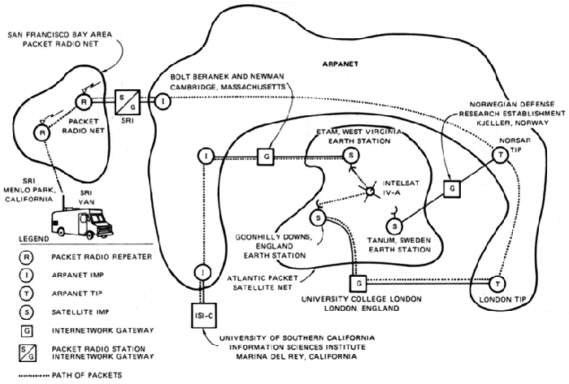!](https://interstices.info/une-breve-histoire-des-reseaux-de-telecommunications/)

    _Source : Interstices_

     Aux États-Unis, [Vinton Cerf et Robert Kahn](https://fr.wikipedia.org/wiki/Vint_Cerf) s'inspirent des idées de Pouzin et inventent les protocoles **IP** et **TCP**. L'interconnexion des réseaux Arpanet et Csnet en 1983 avec **TCP/IP** marque la naissance d'Internet et son expansion au niveau mondial dans les sphères universitaires et de la recherche.

    En 1989, [Tim Berners-Lee](https://interstices.info/les-debuts-du-web-sous-loeil-du-w3c/) invente le **Web**, qui est une application de documents hypertexte s'exécutant par-dessus le réseau **Internet**. L'ouverture des protocoles Web au grand public en 1993 connaît un succès fulgurant, d'autres services Internet comme le Mail ou le transfert de fichier de Pair à pair se popularisent aussi et le trafic  Internet explose : de quelques Megabits par secondes en 1992, on est passé à près de 100 Terabits par seconde en 2018 avec près de 3,2 milliards d'internautes en 2016.

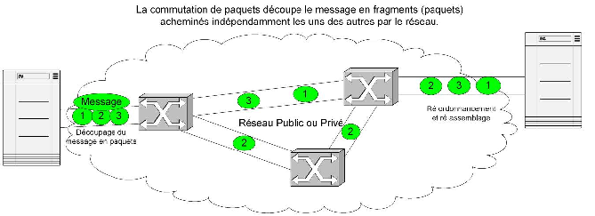

## Terminologie et classification des réseaux

!!! note "Définition 1"

    1. Un __réseau__ est un ensemble de *noeuds* reliés par des *liens*, qui correspond mathématiquement à un *graphe*. Dans un  __réseau informatique__  les *noeuds* ou *hôtes* sont des  équipements informatiques comme des ordinateurs, des routeurs ... et les *liens* peuvent être variés selon la technologie utilisée :  filaire (Ethernet, ...) ou par ondes (Wifi, ...).
    2. Une __interface__ est le point de raccordement, matériel (carte réseau) ou logiciel, entre un *lien* et un *noeud*.
    3.  Un __protocole__ est un ensemble de règles permettant d'établir une communication entre deux noeuds du réseau et de garantir éventuellement certains services (fiabilité, confidentialité ....) 
    4.  Un __service réseau__ est une *application* capable de communiquer en réseau et proposant des fonctionnalités. Par exemple, un service Web peut fournir des pages Web au   navigateur d'un client. Sur un réseau pédagogique de lycée, un service de gestion et de partage de fichiers permet aux utilisateurs d'accéder à leurs fichiers depuis n'importe quel machine cliente.
    5.  Un __serveur__ désigne un matériel ou un logiciel exécutant un __service réseau__. Il fournit un service à des __clients__ selon une __architecture client / serveur__. 
    Pour une présentation de l'architecture client-serveur, on pourra visionner cette [video](https://vimeo.com/138623558).

<figure>
<figcaption aria-hidden="true">Architecture client / serveur (Wikimedia Commons)</figcaption>
</figure>

!!! note "Point de cours 1"

    * Les réseaux informatiques peuvent être de différentes tailles : 
        * Les *réseaux locaux* ou **Local Area Network (LAN)**  limités à une zone géographique restreinte (maison, entreprise, lycée ...)
        * Les *réseaux étendus* ou **Wide Area Network (WAN)**  couvrant de vastes zones géographiques (pays, continent ). Ce sont, par exemple, les réseaux des fournisseurs d'accès internet (Free, Orange, SFR...), de grandes sociétés...
        * **Internet est une interconnexion  mondiale de réseaux**
    * Les réseaux informatiques utilisent des liens de technologies diverses  :
        * Des **liaisons filaires** :
            * *câbles à paires torsadées*  utilisées avec le protocole de liaison Ethernet dans les **LAN** : sensibles aux interférences électromagnétiques même s'ils sont blindés, leur  portée maximale est  de 200 mètres avec un débit maximal de 1 Gb/s ;
            * *fibres optiques* utilisées pour les interconnexions de réseau (dont les câbles sous-marin pour les liaisons intercontinentales) avec un débit de plusieurs Gb/s et des contraintes de portée réduites (sauf pour l'hypertrading des places financières !)
        * Des **liaisons par ondes** : Wifi, Bluetooth, Satellite, 4G ...
    * L'interconnexion dans l'Internet de tous ces réseaux hétérogènes sur le plan matériel, a été rendu possible par le développement de **protocoles logiciels**.
    Pour une présentation globale d'Internet, on pourra visionner cette [video](https://youtu.be/dCknqcjcItU).

<figure>
<figcaption aria-hidden="true">Cartes des câbles sous-marins : <a href="https://www.submarinecablemap.com/" class="uri">https://www.submarinecablemap.com/</a></figcaption>
</figure>

!!! tip "Exercice 1"

    _QCM type E3C_

    1. Un protocole est un ensemble de ...

        * **Réponse A :**  matériels connectés entre eux
        * **Réponse B  :**  serveurs et de clients connectés entre eux
        * **Réponse C  :**  règles qui régissent les échanges entre équipements informatiques
        * **Réponse D  :** règles qui régissent les échanges entre un système d'exploitation et les applications

        ??? help "Réponse"

            __Réponse C__

    2. Comment s'appelle l'ensemble des règles qui régissent les échanges sur
    Internet ?

        * **Réponse A :**  les couches
        * **Réponse B  :**  le wifi
        * **Réponse C  :**  les protocoles
        * **Réponse D  :** les commutateurs

        ??? help "Réponse"

            __Réponse C__

    3. L'architecture client-serveur :

        * **Réponse A :**  est un mode de communication entre programmes
        * **Réponse B  :**  est une architecture matérielle de coopération entre machines
        * **Réponse C  :**  est un mode de communication entre routeurs
        * **Réponse D  :** est un mode de communication entre commutateurs

        ??? help "Réponse"

            __Réponse A__

# Le modèle en couches

## Découpage des données en paquets

!!! note "Point de cours 2"

    Dans un réseau informatique, si on veut transmettre une image de plusieurs Méga octets, on n'envoie pas les données en un seul bloc mais on les découpe en paquets plus petits  qui sont transmis séparément. Ainsi, il n'est pas nécessaire de tout retransmettre en cas d'erreur. De plus cela réduit les risques d'encombrement ou de blocage des liens.

    Ce principe de **découpage des données en paquets** s'appelle le **multiplexage**.

  

*Réseau sans multiplexage : canal bloqué (source : https://www.isnbreizh.fr)*

  

*Réseau avec multiplexage (source : https://www.isnbreizh.fr)*

## Modèle en couches et encapsulation des données

!!! note "Point de cours 3"

    L'interconnexion de réseaux hétérogènes et éloignés géographiquement nécessite de gérer des problématiques à plusieurs niveaux :

    1. la liaison physique entre deux *noeuds* / *hôtes*  du réseau ; 
    2. l'interconnexion entre deux réseaux locaux ;
    3. la transmission fiable des données ;
    4. la communication entre une application s'exécutant sur un client et un service réseau sur un serveur.

    Les recherches et les expériences menées dans les années 60/70 sur les réseaux informatiques ont conduit au développement de solutions basées sur une **architecture en pile de protocoles logiciels**. Les  problèmes ont été séparés en **couches**. Le [modèle OSI](https://fr.wikipedia.org/wiki/Mod%C3%A8le_OSI)   comporte sept couches, c'est un modèle théorique et normalisé qui permet d'encadrer  la création de nouveaux protocoles. En pratique, Internet s'appuie sur le [modèle TCP/IP](https://fr.wikipedia.org/wiki/Suite_des_protocoles_Internet) en quatre couches correspondant aux quatre niveaux de problèmes précités. De la couche la plus basse à la plus haute on distingue :

    1. la *couche liaison*
    2. la *couche réseau*
    3. la *couche transport*
    4. la *couche application*

    Lorsqu'un hôte A du réseau communique avec un hôte B, chaque couche de protocole sur l'émetteur communique avec la couche de même niveau chez le destinataire. 

    Chaque couche ajoute des *metadonnées* aux données du message, qui sont encapsulées les unes dans les autres. C'est le principe d'**encapsulation des données**.

    Lors de l'émission le message par l'hôte A, les couches s'exécutent de haut en bas  pour l'encapsulation :

    * un protocole de la  *couche application* encapsule le message avec un entête contenant ses *metadonnées*  et transmet   *application(message)*  à la couche inférieure
    * puis une protocole de la  *couche transport* ajoute son entête : *transport(application(message))* 
    * puis un protocole de la *couche réseau*  fait de même : *réseau(transport(application(message)))* 
    * et enfin un protocole de la *couche liaison* transmet le message sur le support avec un dernier entête : *liaison(réseau(transport(application(message))))* 

    À réception du message par l'hôte B, les couches d'exécutent en ordre inverse pour désencapsuler le message :

    * un protocole de la  *couche liaison* extrait et analyse l'entête *liaison* ajouté par son homologue et transmet *réseau(transport(application(message)))*  à la couche supérieure
    * un protocole de la  *couche réseau* extrait et analyse l'entête *réseau* ajouté par son homologue et transmet *transport(application(message))*  à la couche supérieure
    * de même un protocole de la couche *transport* extrait un entête et transmet *application(message)* à la couche supérieure *application*
    * un protocole de la couche *application* extrait le dernier entête et transmet le *message* à l'application destinataire.

    Dans ces deux phases, on voit qu'un protocole doit pouvoir communiquer avec un protocole de couche immédiatement inférieure ou supérieure par le biais d'une **interface**.  

    **L'encapsulation des données** permet d'isoler les fonctionnalités et de développer indépendamment les protocoles de différentes couches. 

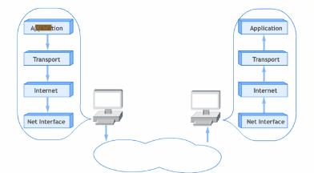

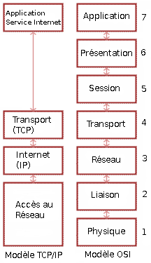

!!! tip "Exercice 2"

    _QCM type E3C_

    Quel est le principe de l'encapsulation des données dans un réseau informatique ?

    * **Réponse A :**  Cacher les données afin que l'on ne puisse pas les lire
    * **Réponse B  :**  Mettre les données les unes à la suite des autres
    * **Réponse C  :**  Inclure les données d'un protocole dans un autre protocole
    * **Réponse D  :** Chiffrer les données afin que l'on ne puisse pas les lire

    ??? help "Réponse"

        __Réponse C__

## La couche liaison du modèle TCP/IP

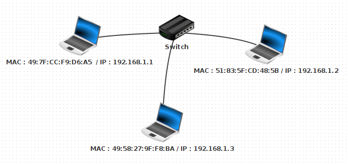

!!! info "Activité 1"

    ??? warning "Téléchargement de l'archive"

        [Archive avec les fichiers Filius](ressources/materiel-filius.zip)

    1. Ouvrir avec le logiciel [Filius](https://www.lernsoftware-filius.de/Herunterladen) le fichier `lan2.fls`. Quels sont les équipements présents dans ce  réseau ?
    Sélectionner le mode *construction* {width="10%"}\ Faire un clic droit sur chacune des machines du réseau, sélectionner *Configurer* et noter leur adresse MAC. Il s'agit d'un identifiant pour chaque matériel constitué de 6 paquets de 8 bits codés en base 16, séparés par le symbole `:`.

    2. Compléter les fonctions Python ci-dessous pour satisfaire spécifications et tests unitaires. 
    
        ~~~python
        #variable globale
        chiffres_hexa = {str(k) : k for k in range(10) }
        k = 10
        for c in 'ABCDEF':
            #chiffres_hexa[c] = "à compléter"
            k = k + 1
        #postcondition
        assert chiffres_hexa == {'0': 0, '1': 1, '2': 2, '3': 3, '4': 4, '5': 5, '6': 6, 
        '7': 7, '8': 8, '9': 9, 'A': 10, 'B': 11, 'C': 12, 'D': 13, 'E': 14, 'F': 15}

        def hexa_vers_decimal(chaine_hexa):
            """
            Paramètre : chaine_hexa de type str
            Valeur renvoyée : decimal de type int, conversion en base dix de la représentation
            heaxdécimale d'un nombre
            """
            decimal = 0
            "à compléter"
            return decimal

        #test unitaire
        assert [hexa_vers_decimal(c) for c in ['FF', '00', '0A', 'A9']] == [255,0,10,169]

        def mac_adresse_vers_decimal(mac_adresse):
            """
            Paramètre : mac_adresse de type str, sous la forme '8D:A9:D5:67:E6:F3'
            Valeur renvoyée : tableau de six nombres de type int, conversion en base dix de chaque champ de l'adresse MAC
            """
            champs = mac_adresse.split(':')
            return "à compléter"

        #test unitaire
        assert mac_adresse_vers_decimal('8D:A9:D5:67:E6:F3') == [141, 169, 213, 103, 230, 243]
        assert mac_adresse_vers_decimal('FF:FF:FF:FF:FF:FF') == [255, 255, 255, 255, 255, 255]
        ~~~

        ??? help "Réponse"

            ~~~python
            #variable globale
            chiffres_hexa = {str(k) : k for k in range(10) }
            k = 10
            for c in 'ABCDEF':
                chiffres_hexa[c] = k
                k = k + 1
            #postcondition
            assert chiffres_hexa == {'0': 0, '1': 1, '2': 2, '3': 3, '4': 4, '5': 5, '6': 6, 
            '7': 7, '8': 8, '9': 9, 'A': 10, 'B': 11, 'C': 12, 'D': 13, 'E': 14, 'F': 15}

            def hexa_vers_decimal(chaine_hexa):
                """
                Paramètre : chaine_hexa de type str
                Valeur renvoyée : decimal de type int, conversion en base dix de la représentation
                heaxdécimale d'un nombre
                """
                decimal = 0
                for c in chaine_hexa:
                    decimal = decimal * 16 +  chiffres_hexa[c]
                return decimal

            #test unitaire
            assert [hexa_vers_decimal(c) for c in ['FF', '00', '0A', 'A9']] == [255,0,10,169]

            def mac_adresse_vers_decimal(mac_adresse):
                """
                Paramètre : mac_adresse de type str, sous la forme '8D:A9:D5:67:E6:F3'
                Valeur renvoyée : tableau de six nombres de type int, conversion en base dix de chaque champ de l'adresse MAC
                """
                champs = mac_adresse.split(':')
                return [hexa_vers_decimal(chaine_hexa) for chaine_hexa in champs]

            #test unitaire
            assert mac_adresse_vers_decimal('8D:A9:D5:67:E6:F3') == [141, 169, 213, 103, 230, 243]
            assert mac_adresse_vers_decimal('FF:FF:FF:FF:FF:FF') == [255, 255, 255, 255, 255, 255]
            ~~~

    3. Sélectionner le mode *simulation* {width="10%"}\  Faire un clic droit sur la machine d'adresse IP `192.168.1.1` pour afficher le bureau, ouvrir une fenêtre de ligne de commandes et saisir la commande `ping 192.168.1.2` qui envoie successivement quatre paquets de données pour tester la liaison avec la machine d'adresse IP `192.168.1.1`. Sélectionner l'affichage des échanges de données avec un clic droit sur la machine `192.168.1.1`. 
       
    4. Déplier le détail du premier paquet de données dans l'historique des échanges. Filius appelle *Réseau* la couche *liaison* du [modèle TCP/IP](https://fr.wikipedia.org/wiki/Suite_des_protocoles_Internet)  et *internet* la couche *réseau*. Quel protocole a généré l'entête de la couche *internet* ? Quel message est transmis  ? Déterminer l'émetteur  et le destinataire de ce paquet de données et comment ils sont repérés.

      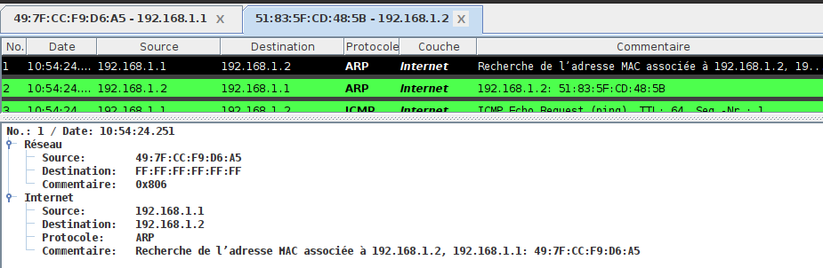\

    5. Déplier le détail du second paquet de données et répondre aux mêmes questions.

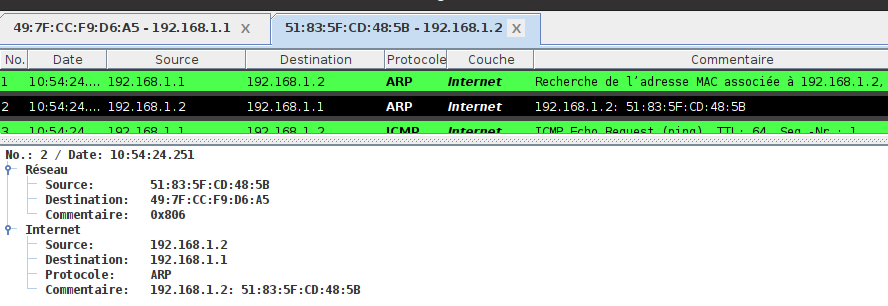  

!!! note "Point de cours 4"

    La  couche *liaison* du [modèle TCP/IP](https://fr.wikipedia.org/wiki/Suite_des_protocoles_Internet) rassemble les protocoles permettant d'établir une connexion physique directe, par la même technologie, de deux hôtes d'un même réseau local (**LAN**).

    Les protocoles les plus courants de cette couche sont  [Ethernet](https://fr.wikipedia.org/wiki/Ethernet)  pour une liaison filaire et [Wifi](https://fr.wikipedia.org/wiki/Wi-Fi) pour une liaison par ondes.

    Dans les deux cas, chaque hôte est identifié  par une [adresse MAC](https://fr.wikipedia.org/wiki/Adresse_MAC), parfois nommée **adresse physique**. C'est un identifiant physique stocké dans une carte réseau ou une interface réseau similaire. À moins qu'elle n'ait été modifiée par l'utilisateur, elle est unique au monde.

    Elle est constitué de  $48$ bits réparties en $6$ octets représentés en notation hexadécimale et séparés par le caractère `:` comme par exemple `fc:f8:ae:31:cb:67`.

     
    Les hôtes d'un même réseau [Ethernet](https://fr.wikipedia.org/wiki/Ethernet) (clients ou serveurs), sont reliés par une sorte de multiprise appelée  **commutateur** ou **switch**, capable d'identifier l'[adresse MAC](https://fr.wikipedia.org/wiki/Adresse_MAC) de l'hôte relié à l'une de ses prises.

    Le protocole [ARP](https://fr.wikipedia.org/wiki/Address_Resolution_Protocol) permet à un hôte émetteur de découvrir l'[adresse MAC](https://fr.wikipedia.org/wiki/Adresse_MAC) de son destinataire, à travers la diffusion d'une demande en [brodacast](https://fr.wikipedia.org/wiki/Broadcast_(informatique)), dénotée par l'adresse `FF:FF:FF:FF:FF:FF`  à l'ensemble des hôtes du réseau local. 

[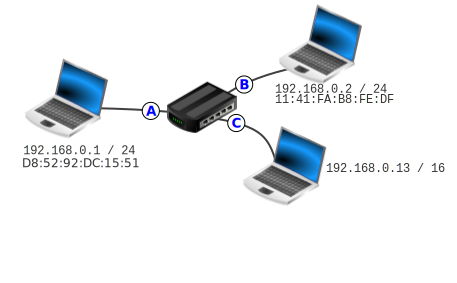](images/animation-reseau-simple.svg)

_Pour accéder à cette animation créée par Maxence Klein, cliquez sur l'image_

!!! tip "Exercice 3"

    _QCM type E3C_

    Parmi les adresses suivantes, laquelle est une adresse Ethernet non valide ?

    * **Réponse A :**  8D:A9:D5:67:E6:F3
    * **Réponse B  :**  8d:a9:d5:67:e6:f3
    * **Réponse C  :**  8H:A9:D5:67:E6:F3
    * **Réponse D  :** FF:A9:D5:67:E6:F3

    ??? help "Réponse"

        __Réponse C__  le chiffre maximal en hexadécimal est F,  H ne représente pas un chiffre en hexadécimal

## La couche réseau, ou internet, du modèle TCP/IP

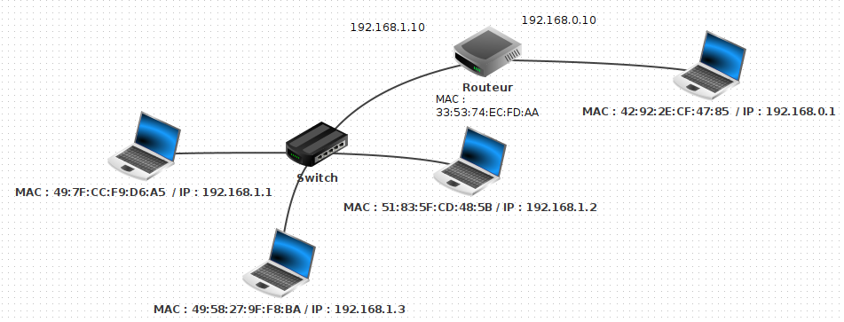

!!! info "Activité 2"

    ??? warning "Téléchargement de l'archive"

        [Archive avec les fichiers Filius](ressources/materiel-filius.zip)
 

    1. Ouvrir avec le logiciel [Filius](https://www.lernsoftware-filius.de/Herunterladen) le fichier `wlan1.fls`. Quels sont les équipements présents dans ce  réseau ?
    Sélectionner le mode *construction* {width="10%"}\ Faire un clic droit sur chacune des machines du réseau, sélectionner *Configurer* et noter leurs adresse IP. Il s'agit d'un identifiant  de 32 bits constitué de quatre octets notés en base dix (valeurs entre 0 et 255) séparés par le symbole `.` 

    2. Sélectionner le mode *simulation* {width="10%"}\  Faire un clic droit sur la machine d'adresse IP `192.168.1.1` pour afficher le bureau, ouvrir une fenêtre de ligne de commandes et saisir la commande `ping 192.168.0.1` qui envoie successivement quatre paquets de données pour tester la liaison avec la machine d'adresse IP `192.168.0.1`. Sélectionner l'affichage des échanges de données avec un clic droit sur la machine `192.168.0.1`. 
       

    3. Pour les quatre premiers paquets de données échangées, noter les adresses MAC et IP de l'émetteur et du destinataire et déterminer la fonction de chaque message.

    <!--Quel protocole de la couche **Internet** est utilisé par la commande `ping` ? -->

    4. Recommencer l'opération mais en testant la liaison entre les hôtes `192.168.1.1` et `192.168.1.2`. Quelles différences peut-on noter ? 

    5. Dans une interconnexion de réseau, chaque interface est identifiée de façon unique par son adresse IP. Les adresses IP de la forme `192.168.1.X` correspondent à des interfaces qui sont dans le même réseau local, les adresses IP de la forme `192.168.0.X` dénotent un autre réseau local. Ces deux réseaux sont interconnectés par un **routeur**.  

        * Quelle est la particularité du **routeur** ? 

        * Si on compare une interconnexion de réseau comme Internet au réseau postal, quelle analogie peut-on faire pour une adresse IP ?

    6. Passer en mode construction et afficher les configurations des hôtes d'adresses IP `192.168.1.1` et `192.168.0.1`. Convertir en binaire les quatre entiers composant le masque et faire un ET logique bit à bit entre le masque et l'adresse IP de l'hôte. Quelle adresse IP obtient-on ?

    7. Échanger les machines d'adresses MAC  `49:7F:CC:F9:D6:A5`  et `42:92:2E:CF:47:85`.  En mode construction, permuter leurs configurations réseau : adresse IP et adresse de la passerelle. Tester la liaison avec la commande `ping`.

        * D'après vous ,pourquoi désigne-t-on l'adresse MAC comme adresse physique et l'adresse IP comme adresse logique ?

    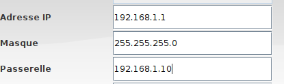\
    &
    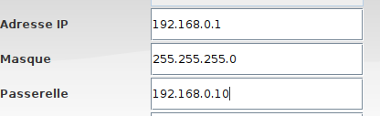\

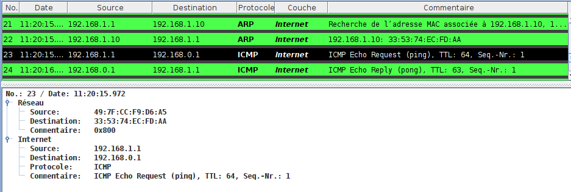

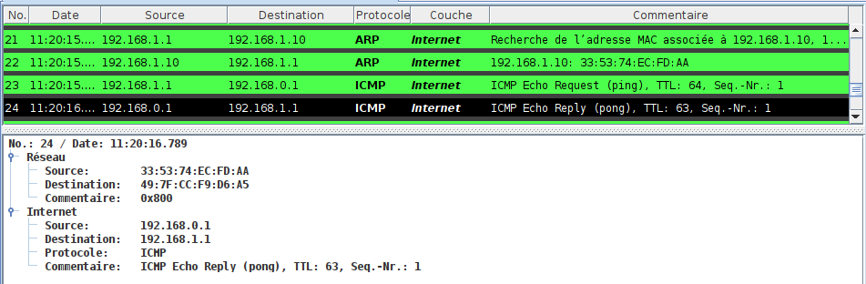  

*Pong de 192.168.1.1 vers 192.168.0.1*

!!! note "Point de cours 5"

    * Dans les années 1970, [Vinton Cerf et Robert Kahn](https://fr.wikipedia.org/wiki/Vint_Cerf) en s'inspirant des travaux de [Louis Pouzin](https://interstices.info/louis-pouzin-la-tete-dans-les-reseaux/), ont développé le protocole [Internet Protocol (IP)](https://fr.wikipedia.org/wiki/Internet_Protocol) qui permet d'interconnecter des réseaux locaux. C'est un protocole de la couche *réseau* ou  *internet* dans le [modèle en couches TCP/IP](https://fr.wikipedia.org/wiki/Suite_des_protocoles_Internet).

    * La première fonctionnalité du protocole [IP](https://fr.wikipedia.org/wiki/Internet_Protocol) est *l'adressage*. 
        * Chaque interface d'une machine  hôte de l'interconnexion de réseaux reçoit un identifiant unique appelé  **adresse IP**. Dans la version 4 du protocole, elle est représentée sur 32 bits par 4 octets notés en décimal séparés par des points. Selon le principe d'**encapsulation des données**, les adresses  [IP](https://fr.wikipedia.org/wiki/Internet_Protocol)  de l'émetteur et du destinataire du message sont ajoutés dans *l'entête* [IP](https://fr.wikipedia.org/wiki/Internet_Protocol).

        [{width="60%"}](https://commons.wikimedia.org/wiki/File:Addresse_Ipv4.svg)

        * L'adresse [IP](https://fr.wikipedia.org/wiki/Internet_Protocol)  est une **adresse logique**, elle n'est pas attachée définitivement à une machine, elle peut changer si la machine est déplacée dans un autre réseau. De plus une adresse [IP](https://fr.wikipedia.org/wiki/Internet_Protocol) dénote une interface réseau et une machine, comme un **routeur**, peut en posséder plusieurs.
        * Il existe des adresses [IP](https://fr.wikipedia.org/wiki/Internet_Protocol) spéciales comme `127.0.0.1` qui correspond à la machine elle-même.

    * La seconde fonctionnalité du protocole [IP](https://fr.wikipedia.org/wiki/Internet_Protocol) est *le routage* des paquets de données à travers différents réseaux locaux. 
        * Un **routeur** est un équipement situés à la frontière d'au moins deux réseaux, possédant une interface  dans   (et donc au moins deux adresses IP) et qui joue le rôle de **passerelle** entre les deux.
        *  En pratique un émetteur envoie un paquet de données directement à son destinataire (en passant par un **switch**) s'il est sur le même réseau local et sinon il le transmet à sa **passerelle**. Celle-ci peut le transmettre directement si elle est connectée au réseau du destinataire sinon elle l'envoie à une autre **passerelle**. 
        *  De proche en proche et grâce à des *algorithmes de routage*, le message parvient jusqu'au destinataire. Chaque **passerelle** possède des *tables de routage* pour déterminer le prochain saut dans la transmission d'un message reçu.
        *  Tous les  paquets de données  transmis d'un hôte émetteur vers un destinataire ne suivent pas forcément le même chemin. Si la topologie physique de l'interconnexion de réseaux évolue (routeurs ajoutés, enlevés, en panne) ou si le trafic est trop important sur certains liens, les routeurs intermédiaires vont dynamiquement mettre à jour leurs *tables de routages* et peuvent changer le routage de paquets avec le même couple (émetteur, destinataires). C'est le principe de la **commutation de paquets**. 
        *  Une *configuration réseau* permet à un hôte émetteur de déterminer si le destinataire d'un message fait partie du même réseau local. Cette configuration est constituée :
           *  de l'adresse  [IP](https://fr.wikipedia.org/wiki/Internet_Protocol) de l'interface
           *  de l'adresse [IP](https://fr.wikipedia.org/wiki/Internet_Protocol) de sa **passerelle**
           *  d'un **masque de sous-réseau** au format d'une adresse [IP](https://fr.wikipedia.org/wiki/Internet_Protocol) qui permet de séparer les parties *réseau* et *hôte* dans une adresse [IP](https://fr.wikipedia.org/wiki/Internet_Protocol). Tous les hôtes d'un même réseau local partagent le même *préfixe réseau*. 
        * Une *configuration réseau* peut être attribuée automatiquement par le service réseau [DHCP](https://fr.wikipedia.org/wiki/Dynamic_Host_Configuration_Protocol) ou de façon statique dans un fichier de configuration. 
         

!!! success "Méthode 1"

    Voici quelques exemples pour extraire le *préfixe réseau* à partir d'une adresse  [IP](https://fr.wikipedia.org/wiki/Internet_Protocol) et d'un **masque de sous-réseau**. Il faut effectuer un **ET logique** entre les représentations binaires de l'adresse [IP](https://fr.wikipedia.org/wiki/Internet_Protocol) et du **masque de sous-réseau**.

    _Cette méthode est hors-programme pour le bac !_

    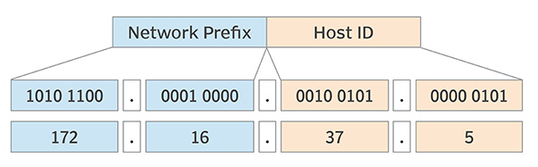{width="50%"}\

    1. Si le nombre de bits du **masque de sous-réseau** est un multiple de 8  : `255.0.0.0`, `255.255.0.0`, ou `255.255.255.0` il suffit de masquer la partie de l'adresse [IP](https://fr.wikipedia.org/wiki/Internet_Protocol)  correspondant aux `0` du masque. Le passage en binaire n'est pas nécessaire.

      | Adresse        | Binaire                             | Décimal       |
      |----------------|-------------------------------------|---------------|
      | adresse IP     | 00010111.10101000.00010111.00000010 | 192.168.23.2  |
      | masque         | 11111111.11111111.11111111.00000000 | 255.255.112.0 |
      | adresse réseau | 11000000.10101000.00010111.00000000 | 192.168.23.0  |

    2. Sinon, le passage en binaire est nécessaire.

      | Adresse        | Binaire                             | Décimal       |
      |----------------|-------------------------------------|---------------|
      | adresse IP     | 00010111.10101000.00010111.00000010 | 192.168.23.2  |
      | masque         | 11111111.11111111.11110000.00000000 | 255.255.112.0 |
      | adresse réseau | 11000000.10101000.00010000.00000000 | 192.168.16.0  |

    Un **masque de sous-réseau** peut être caractérisé par sa longueur en bits. La notation [CIDR](https://fr.wikipedia.org/wiki/Sous-r%C3%A9seau) est une façon compacte d'ajouter cette information à la suite d'une adresse [IP](https://fr.wikipedia.org/wiki/Internet_Protocol) en les séparant par le symbole `/`.

    L'adresse du premier exemple sera ainsi notée `192.168.23.2/24` et celle du second `192.168.23.2/20`.

    Pour s'entraîner on pourra utilise ce [calculateur en ligne](https://cric.grenoble.cnrs.fr/Administrateurs/Outils/CalculMasque/).

!!! tip "Exercice 4"

    Donner les adresses réseau correspondant à ces adresses  [IP](https://fr.wikipedia.org/wiki/Internet_Protocol)  en notation [CIDR](https://fr.wikipedia.org/wiki/Sous-r%C3%A9seau) :  148.33.1.112/8 ,  82.30.12.18/24 et  91.198.174.3/19

    ??? help "Réponse"

        * Pour l'adresse 148.33.1.112/8, le masque est 255.0.0.0 et l'adresse réseau s'obtient par un ET logique entre l'adresse hôte  et l'adresse  réseau (en binaire) ce qui nous donne 148.0.0.0
        * Pour l'adresse 82.30.12.18/24, le masque est 255.255.255.0 et l'adresse réseau s'obtient par un ET logique entre l'adresse hôte et l'adresse  réseau (en binaire)  ce qui nous donne 82.30.12.0 (en décimal)
        * Pour l'adresse 91.198.174.3/19, le masque est 11111111.11111111.11100000.00000000 en binaire soit 91.198.224.0 en décimal et l'adresse réseau s'obtient par un ET logique entre l'adresse hôte et l'adresse  réseau (en binaire) ce qui nous donne 91.198.160.0 (en décimal)

!!! success "Méthode 2"

    Quelques commandes réseau sont à connaître.

    1. La commande `ping` permet de tester la liaison avec un  hôte si on connaît son adresse  [IP](https://fr.wikipedia.org/wiki/Internet_Protocol) ou son nom de domaine. On l'interrompt avec le signal envoyé par  `CTRL + C`.

    ~~~bash
    junier@fredportable:~$ ping 192.168.1.254
    PING 192.168.1.254 (192.168.1.254) 56(84) bytes of data.
    64 bytes from 192.168.1.254: icmp_seq=1 ttl=64 time=2.27 ms
    64 bytes from 192.168.1.254: icmp_seq=2 ttl=64 time=3.83 ms
    64 bytes from 192.168.1.254: icmp_seq=3 ttl=64 time=2.60 ms
    ^C
    --- 192.168.1.254 ping statistics ---
    9 packets transmitted, 9 received, 0% packet loss, time 8013ms
    rtt min/avg/max/mdev = 2.184/3.020/4.642/0.844 ms
    ~~~

    2. Les commandes `ifconfig` ou `ip address` sous Linux ou `ipconfig` sous Windows permettent d'afficher les adresses  physique (MAC) ou logiques (IP) d'une interface réseau. Par exemple l'adresse MAC de l'interface Wifi ci-dessous est `fc:f8:ae:31:cb:67` et son adresse IPV4, au moment de l'exécution, était `192.168.1.98`. On remarque un autre format  IPV6 codé sur 128 bits en hexadécimal, mis en place progressivement pour faire face à la pénurie d'adresses IPV4 sur 32 bits (soit $2^{32}=4294967296$ adresses).

    ~~~bash
    anonymous@laptop:~$ ifconfig
    wlp2s0: flags=4163<UP,BROADCAST,RUNNING,MULTICAST>  mtu 1500
            inet 192.168.1.98  netmask 255.255.255.0  broadcast 192.168.1.255
            inet6 fe80::2d0d:7c56:cc75:cadb  prefixlen 64  scopeid 0x20<link>
            ether fc:f8:ae:31:cb:67  txqueuelen 1000  (Ethernet)
            RX packets 50800  bytes 45120378 (45.1 MB)
            RX errors 0  dropped 0  overruns 0  frame 0
            TX packets 37659  bytes 5251257 (5.2 MB)
    ~~~

    3. La commande `route -n` sous Linux permet d'afficher la passerelle et le masque de sous-réseau d'une interface. Ci-dessous l'adresse de l'hôte est `192.168.1.0`, celle de la passerelle `192.168.1.254` et le masque est `255.255.255.0`.

    ~~~bash
    anonymous@laptop:~$ route -n
    Table de routage IP du noyau
    Destination     Passerelle      Genmask         Indic Metric Ref    Use Iface
    0.0.0.0         192.168.1.254   0.0.0.0         UG    600    0        0 wlp2s0
    192.168.1.0     0.0.0.0         255.255.255.0   U     600    0        0 wlp2s0
    ~~~

    4. La commande `traceroute` utilise le champ [TTL](https://fr.wikipedia.org/wiki/Time_to_Live) de l'*entête* IP pour tracer les routeurs sur le chemin entre un hôte émetteur et un destinataire dont on connaît l'adresse  [IP](https://fr.wikipedia.org/wiki/Internet_Protocol) ou le nom de domaine. Le nombre de sauts maximum est de 30.

    ~~~bash
    anonymous@laptop:~$ traceroute qwant.com
    traceroute to qwant.com (194.187.168.99), 30 hops max, 60 byte packets
     1  _gateway (192.168.1.254)  5.397 ms  5.415 ms  6.008 ms
     2  176-145-144-2.abo.bbox.fr (176.145.144.2)  29.450 ms  29.952 ms  31.584 ms
     3  212.194.170.233 (212.194.170.233)  38.825 ms  42.428 ms  43.469 ms
     4  be5.cbr01-ntr.net.bbox.fr (212.194.171.137)  44.712 ms  45.358 ms  46.831 ms
     5  * * *
     6  qwant.par.franceix.net (37.49.236.134)  48.854 ms  25.381 ms  25.308 ms
    ~~~

!!! tip "Exercice 5"

    _QCM type E3C_

    1. Laquelle de ces écritures ne désigne pas une adresse IP ?

        * **Réponse A :**  127.0.0.1
        * **Réponse B  :**  207.142.131.245
        * **Réponse C  :**  192.168.229.48
        * **Réponse D  :** 296.141.2.4

        ??? help "Réponse"

            __Réponse D__ Chaque champ d'une adresse IP est codée sur 8 bits donc sa valeur maximale en décimal est de 255

    2. Sur la configuration IP d'une machine nommée MACH01 on peut lire :

        adresse Ipv4 : 172.16.100.201 Masque de sous-réseau : 255.255.0.0  Passerelle : 172.16.0.254

        Sur la configuration IP d'une machine nommée MACH02 on peut lire :

        adresse Ipv4 : 172.16.100.202 Masque de sous-réseau : 255.255.0.0  Passerelle : 172.16.0.254

        Depuis la machine MACH02, à l'aide de quelle commande peut-on tester le
        dialogue entre ces deux machines ?

        * **Réponse A :**  ping 172.16.100.201
        * **Réponse B  :**  ping 172.16.100.202
        * **Réponse C  :**  ping 172.16.100.254
        * **Réponse D  :**  ping 255.255.0.0

        ??? help "Réponse"

            __Réponse A__ 

    3. Dans un terminal sous Linux, à quoi sert la commande traceroute ?

        * **Réponse A :**  à afficher un itinéraire routier entre deux villes
        * **Réponse B  :**  c'est un synonyme pour la commande ping
        * **Réponse C  :**  à afficher le chemin suivi par des paquets à travers un protocole IP
        * **Réponse D  :**  à suivre pas à pas l'exécution d'un programme

        ??? help "Réponse"

            __Réponse C__ 

    4. Quelle est l'utilité de la commande ping dans un réseau informatique ?

        * **Réponse A :**  établir un réseau privé virtuel
        * **Réponse B  :**  tester si la connexion peut être établie avec une machine distante
        * **Réponse C  :**  obtenir la route suivie par un paquet dans le réseau
        * **Réponse D  :**  mesurer les performances d'une machine distante

        ??? help "Réponse"

            __Réponse B__ 

    5. Quel matériel permet d'interconnecter des **réseaux** entre eux :

        * **Réponse A :**  un routeur
        * **Réponse B  :**  un commutateur (ou *switch*)
        * **Réponse C  :**  un interconnecteur
        * **Réponse D  :**  un serveur

        ??? help "Réponse"

            __Réponse A__ 

    6. Quel protocole permet d'attribuer dynamiquement une adresse IP ?

        * **Réponse A :**  UDP
        * **Réponse B  :**  HTTP
        * **Réponse C  :**  DHCP
        * **Réponse D  :**  DNS

        ??? help "Réponse"

            __Réponse C__ 

     

## La couche transport du modèle TCP/IP

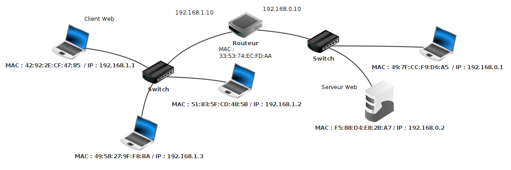

!!! info "Activité 3"

    ??? warning "Téléchargement de l'archive"

        [Archive avec les fichiers Filius](ressources/materiel-filius.zip)

    1. Ouvrir avec le logiciel [Filius](https://www.lernsoftware-filius.de/Herunterladen) le fichier `wlan3.fls`. Il s'agit du même réseau que dans `wlan3.fls` avec un ordinateur d'adresse IP `192.168.0.2`et un switch en plus dans le réseau d'adresse `192.168.0.0`.
    2. Sélectionner le mode *simulation* {width="10%"}\  Faire un clic droit sur la machine d'adresse IP `192.168.0.2`, afficher le bureau, installer un serveur Web et le démarrer.  Faire un clic droit sur la machine d'adresse IP `192.168.1.1`, , afficher le bureau, installer un navigateur  Web et saisir dans la barre d'adresse `http://192.168.0.2` pour envoyer une requête HTTP demandant la page d'accueil du serveur Web sur `192.168.0.2`. Afficher les données échangées, on devrait obtenir l'historique ci-dessous.
    3. La requête HTTP est-elle le premier paquet de données échangé ?

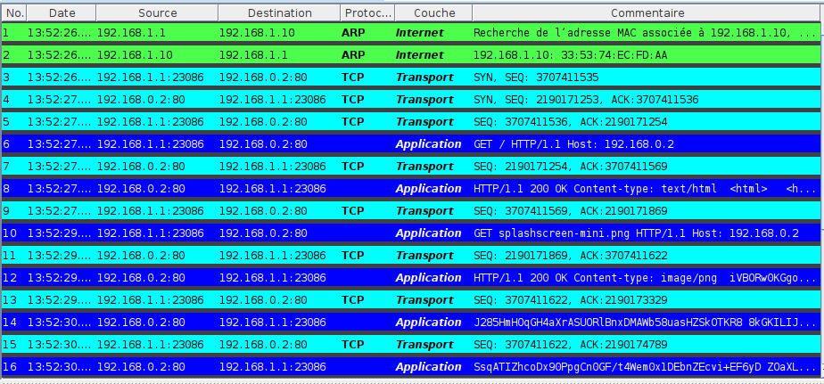

!!! note "Point de cours 6"

    * Le protocole [IP](https://fr.wikipedia.org/wiki/Internet_Protocol)  de la couche *réseau* permet la transmission d'un paquet de données entre deux machines hôtes. Il s'exécute sur tous les routeurs traversés lors du chemin. Néanmoins, plusieurs services réseaux peuvent s'exécuter sur l'émetteur et le destinataire. Pour faire communiquer deux programmes, il faut donc un paramètre d'adresse supplémentaire, appelé **port**.  

    * Les protocoles [TCP](https://fr.wikipedia.org/wiki/Transmission_Control_Protocol)  et [UDP](https://fr.wikipedia.org/wiki/User_Datagram_Protocol) de la couche *transport* encapsulent un paquet  IP à émettre avec un  *entête* contenant les numéros de **port** des appplications chez l'émetteur et le destinataire. 
    Ces protocoles s'exécutent de *bout en bout* sur l'émetteur et le destinataire mais pas sur les routeurs intermédiaires.

    * Par principe de **multiplexage**, les données sont découpées en paquets qui sont transmis séparément sur le réseau et qui peuvent suivre des chemins différents et donc se perdre ou arriver dans le désordre d'après le principe de **commutation de paquets**. Cette souplesse du [modèle TCP/IP](https://fr.wikipedia.org/wiki/Suite_des_protocoles_Internet) est la clef du succès d'Internet mais elle nécessite des mécanismes pour garantir la *fiabilité* des transmissions : ordonner les paquets, demander la réémission de paquets perdus ... 

    * Le protocole [UDP](https://fr.wikipedia.org/wiki/User_Datagram_Protocol) fonctionne en mode non connecté et  n'offre pas ces services car il est utilisé dans des applications avec des questions/réponses simples ([DNS](https://fr.wikipedia.org/wiki/Domain_Name_System) ) ou pour lesquelles les erreurs de transmission ne sont pas critiques et qui ont besoin de rapidité  (streaming video, jeu en ligne ...). 
      
    * Le protocole [TCP](https://fr.wikipedia.org/wiki/Transmission_Control_Protocol) établit une connexion entre l'émetteur et le destinataire  et résout les problèmes de qualité de service grâce à un système d'*accusés de réception*. 
      

    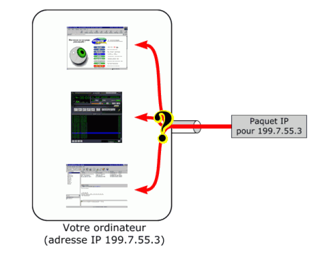\
    &
    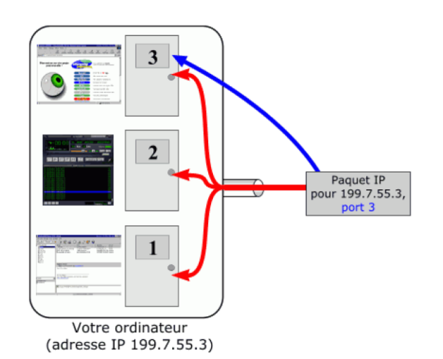\

    _Source : Sébastien Sauvage_ 

!!! success "Méthode 3"

    Expliquons le fonctionnement du protocole [TCP](https://fr.wikipedia.org/wiki/Transmission_Control_Protocol) à partir de l'historique d'échanges de la figure 12.

    _La connaissance de TCP est hors-programme mais nous étudierons en dernière partie un protocole simplifié de récupération de paquets qui est au programme !_

    1. Pour établir une *connexion TCP* entre un émetteur et un destinataire, les deux hôtes procèdent à un partage de numéros de séquences des paquets de données qu'ils vont transmettre lors d'une phase de trois échanges nommée [three handshake](https://fr.wikipedia.org/wiki/Three-way_handshake) (voir figure 13).  Elle correspond aux échanges 3, 4 et 5 de la figure 12 :
       *  Le client d'IP `192.168.1.1` envoie un paquet avec le drapeau `SYN` et un numéro de séquence SEQ 3707411535 qu'il a choisi.
       *  Le serveur `192.168.0.2` lui répond avec un paquet de drapeau`SYN`   qui contient un numéro de séquence SEQ 2190171253 qu'il a choisi et un numéro d'acquittement `ACK` avec le numéro de la prochaine séquence d'octets attendu de `192.168.1.1`, soit $3707411535 + 1 = 3707411536$.
       *  Le client  `192.168.1.1` confirme avec un paquet sans drapeau qui contient le numéro de séquence `SEQ` correspondant au dernier  numéro d'acquittement  `ACK` reçu (soit 3707411536) et un  `ACK` indiquant au serveur le numéro de séquence du prochain paquet attendu, soit $2190171253 + 1 = 2190171254$.
      
    2. Une fois la connexion ouverte, chaque message reçu  est suivi par l'envoi d'un *accusé de réception* (échanges de numéros impairs dans la figure 12) avec un numéro de séquence `SEQ` correspondant au dernier numéro d'acquittement  `ACK` reçu et un accusé de réception indiquant à l'interlocuteur le numéro de séquence attendu lors de son prochain envoi : il se calcule en ajoutant à l'`ACK` précédent la taille du paquet qui vient d'être reçu.  Ainsi chaque interlocuteur peut vérifier si son dernier paquet a été bien reçu (et le renvoyer éventuellement au bout d'un certain temps) et ordonner les paquets s'ils sont arrivés dans le désordre.

    3. Toute connexion [TCP](https://fr.wikipedia.org/wiki/Transmission_Control_Protocol) se termine par un `handshaking`  en quatre  temps avec un échange de paquets marqués par le drapeau `FIN` (voir figure 14)

<figure>
<figcaption aria-hidden="true">Ouverture d’une connexion TCP</figcaption>
</figure>

<figure>
<figcaption aria-hidden="true">Fin d’une connexion TCP</figcaption>
</figure>

!!! tip "Exercice 6"

    _QCM type E3C_ 

    Dans le protocole de communication IP :

    * **Réponse A :**  Les données sont envoyées en une seule partie.
    * **Réponse B  :**  Les données sont envoyées en plusieurs parties qui suivent le même itinéraire au sein du réseau.
    * **Réponse C  :**  Les données sont envoyées en plusieurs parties qui suivent des
    itinéraires différents au sein du réseau et arrivent à destination en
    respectant l'ordre de leur envoi.
    * **Réponse D  :**  Les données sont envoyées en plusieurs parties qui suivent des
    itinéraires différents au sein du réseau et arrivent à destination dans
    un ordre quelconque.

    ??? help "Réponse"

        __Réponse D__

## La couche application du modèle TCP/IP

<figure>
<figcaption aria-hidden="true">Réseaux avec serveur DNS</figcaption>
</figure>

!!! info "Activité 4"

    ??? warning "Téléchargement de l'archive"

        [Archive avec les fichiers Filius](ressources/materiel-filius.zip)

    1. Ouvrir avec le logiciel [Filius](https://www.lernsoftware-filius.de/Herunterladen) le fichier `wlan4.fls`.  Par rapport aux réseaux de `wlan3.fls`, on a rajouté une interface `192.168.2.10` sur le routeur qui est connectée à un réseau local constitué d'une seule machine hôte d'adresse `192.168.2.1`. 

    En pratique, on n'interroge pas un serveur Web avec son adresse [IP](https://fr.wikipedia.org/wiki/Internet_Protocol) mais avec un *nom de domaine*. Pour associer l'adresse [IP](https://fr.wikipedia.org/wiki/Internet_Protocol) `192.168.0.1`  du serveur Web au nom de domaine `www.monsite.org`}, on va rajouter un serveur [DNS](https://fr.wikipedia.org/wiki/Domain_Name_System) sur la machine `192.168.2.1`.

    2. En mode construction, paramétrer le serveur [DNS](https://fr.wikipedia.org/wiki/Domain_Name_System) sur la machine `192.168.1.1` avec l'adresse `192.168.2.1`.

    3. En mode simulation, faire un clic droit sur la machine `192.168.2.1`, installer l'application serveur DNS, ajouter la règle de résolution du nom de domaine `www.monsite.org` par l'adresse [IP](https://fr.wikipedia.org/wiki/Internet_Protocol) du serveur Web et démarrer le serveur [DNS](https://fr.wikipedia.org/wiki/Domain_Name_System).
       
    4. Toujours en mode simulation, depuis la machine `192.168.1.1`, afficher le bureau, ouvrir le navigateur Web et saisir dans la barre d'adresse l'[URL](https://fr.wikipedia.org/wiki/Uniform_Resource_Locator)  <http://www.monsite.org>. Afficher les échanges de données, on doit obtenir un historique similaire à celui de la figure 16. Comparer avec l'historique de la figure 12 où le serveur Web avait été atteint à partir de son adresse IP. Quels paquets de données supplémentaires ont été echangés ? Entre quelles machines ? Quel est leur rôle ?

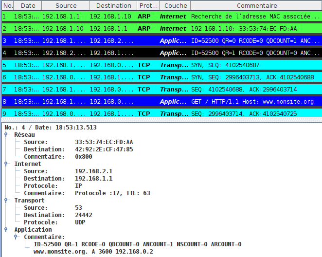

!!! note "Point de cours 7"

    * La *couche application* fournit des services permettant aux applications du client d'utiliser le réseau . 
    * Ces programmes et les protocoles qu'ils utilisent incluent [HTTP](https://fr.wikipedia.org/wiki/Hypertext_Transfer_Protocol) (Web), [FTP](https://fr.wikipedia.org/wiki/File_Transfer_Protocol) (transfert de fichiers), [SMTP](https://fr.wikipedia.org/wiki/Simple_Mail_Transfer_Protocol)(messagerie), [SSH](https://fr.wikipedia.org/wiki/Secure_Shell)(connexion à distance sécurisée) ou [DNS](https://fr.wikipedia.org/wiki/Domain_Name_System) (recherche de correspondance entre noms et adresses IP) ... 
    * Ils sont souvent associés à des **ports** [TCP](https://fr.wikipedia.org/wiki/Transmission_Control_Protocol) particuliers : 80 pour [HTTP](https://fr.wikipedia.org/wiki/Hypertext_Transfer_Protocol), 22 pour [SSH](https://fr.wikipedia.org/wiki/Secure_Shell) ...

!!! success "Méthode 4"

    _Pour le bac il faut juste savoir que DNS est le service de résolution de noms de domaines des URL en adresses IP._

    * Le [DNS](https://fr.wikipedia.org/wiki/Domain_Name_System) , pour _Domain Name System_, fait le lien entre les adresses [IP](https://fr.wikipedia.org/wiki/Internet_Protocol)  et les noms de machine.
    Les noms de domaine figurent en particulier dans les [URL](https://fr.wikipedia.org/wiki/Uniform_Resource_Locator) qui permettent de localiser les ressources dans l'hypertexte du Web. Par exemple dans l'[URL](https://fr.wikipedia.org/wiki/Uniform_Resource_Locator) <https://fst-mathematiques.univ-lyon1.fr/formation/>, le nom de domaine est `fst-mathematiques.univ-lyon1.fr`. Les noms de domaines sont hiérarchisés dans une structure arborescente. Dans un nom de domaine, les domaines imbriqués sont séparés par un point : dans `fst-mathematiques.univ-lyon1.fr`, on a fst-mathematiques sous-domaine de univ-lyon1 sous-domaine de domaine de `fr` qui est un domaine de premier niveau ou Top Level Domain.

    * Le préfixe `www` qui apparaît souvent dans les URL du Web,  désigne un sous-domaine particulier correspondant au  répertoire public par défaut sur le serveur Web. Il n'est pas nécessaire dans l'[URL](https://fr.wikipedia.org/wiki/Uniform_Resource_Locator).
      
    * Les correspondances entre noms de domaine et adresses IP sont déterminées en interrogeant des serveurs [DNS](https://fr.wikipedia.org/wiki/Domain_Name_System)(avec le protocole [DNS](https://fr.wikipedia.org/wiki/Domain_Name_System)...) . Chaque hôte sur internet est paramétré avec un serveur DNS par défaut. Un seul serveur DNS ne pouvant pas connaître toutes les adresses IP, DNS est un système distribué : chaque hôte possède un serveur DNS par défaut qui connaît l'adresse de serveurs racines qui eux-mêmes connaissent les adresses de serveurs DNS administrant les domaines de premier niveau. Pour résoudre un domaine, le serveur DNS de l'hôte procède par interrogations successives jusqu'à atteindre un serveur DNS détenant l'adresse IP du domaine recherché. 

    * Les commandes `host` ou `nslookup` permettent sous Linux de résoudre des noms de domaines  :

    ~~~bash
    junier@fredportable:~$ host qwant.com
    qwant.com has address 194.187.168.99
    qwant.com mail is handled by 50 mail1.qwant.com.
    qwant.com mail is handled by 90 mail2.qwant.com.
    junier@fredportable:~$ nslookup qwant.com
    Server:     127.0.0.53
    Address:    127.0.0.53#53

    Non-authoritative answer:
    Name:   qwant.com
    Address: 194.187.168.99
    ~~~

<figure>
<figcaption aria-hidden="true">Requêtes DNS itératives (source Wikipedia)</figcaption>
</figure>

!!! tip "Exercice 7"

    _QCM type E3C_

    L'adresse IP du site `www.education.gouv.fr` est 185.75.143.24.

    Quel dispositif permet d'associer l'adresse IP et l'URL `www.education.gouv.fr` ?

    * **Réponse A :**  un routeur.
    * **Réponse B  :**  un serveur DNS.
    * **Réponse C  :**  un serveur de temps.
    * **Réponse D  :**  un serveur Web.

    ??? help "Réponse"

        __Réponse B__

# Étude d’un protocole de récupération de paquet

## Le protocole du bit alterné

*Le contenu de cette partie est directement inspiré des cours de [Romain
Janvier](http://archives.janviercommelemois.fr/nsi/fichiers_pdf/feuille-internet.pdf)
ou [David
Roche](https://pixees.fr/informatiquelycee/n_site/nsi_prem.html), merci
à eux.*

!!! note "Point de cours 8"

    * Le **protocole de bit alterné** était implémenté au niveau de la *couche liaison* du modèle OSI. Le principe est simple :  considérons 2 machines en réseau : une machine  A, l'émetteur et  une machine B, le destinataire.  Lors de l'émission d'un paquet de données, A y ajoute un *bit* (1 ou 0) appelé *bit de contrôle*. À réception, B  envoie un *accusé de réception* (acknowledge en anglais souvent noté `ACK`) en lui ajoutant également un *bit de contrôle* (1 ou 0).

    * Pour le choix des *bits drapeaux*, la règle est la suivante  : 
        * le premier paquet envoyé par A aura pour bit de contrôle 0
        * B répond avec un accusé de réception en fixant un *bit alterné* pour  son  bit de contrôle  : donc 1 s'il a reçu 0
        * A reçoit un accusé de réception avec le bit de contrôle 1 donc il sait que son paquet précédent a été reçu et qu'il peut envoyer le paquet suivant avec le bit de contrôle 1 
        * B reçoit un paquet avec le bit de contrôle qui correspond à celui  demandé, il renvoie un accusé de réception avec le *bit alterné* donc 0 
        * ainsi de suite ... le bit de la trame ou de l'accusé de réception alterne de chaque côté

    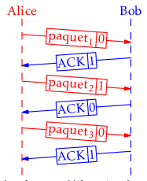\

    _Déroulement du protocole du bit alterné (source : Romain janvier)_

    * Le système de bit de contrôle est complété avec un système d'horloge côté émetteur. Un "chronomètre" est déclenché à chaque envoi de paquet. Si au bout d'un certain temps (le *timeout*), l'émetteur n'a pas reçu un *accusé de réception* correct (avec le bon bit de contrôle), la trame précédemment envoyée par l'émetteur est considérée comme perdue et elle est de nouveau envoyée.
      
    * Considérons quelques cas de perte de paquet :
        * Si un paquet  (avec par exemple le bit de contrôle 0) envoyé par l'émetteur est perdu, l'accusé de réception ne lui revient pas au bout du timeout, il comprend que son paquet a été perdu et il renvoie le paquet.
        * Si l'*accusé de réception* avec le bit de contrôle 1 est perdu, il ne parvient pas à l'émetteur au bout du *timeout* qui renvoie le paquet avec le bit de contrôle 0. Le destinataire reçoit un paquet avec le bit de contrôle 0 alors qu'il attendait le bit de contrôle 1. Il comprend que son acquittement a été perdu et il renvoie son acquittement avec le bit de contrôle 1.

    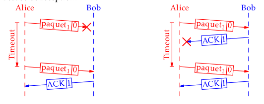\

    _Pertes de paquets dans le protocole du bit alterné (source : Romain janvier)_

## Applications

!!! tip "Exercice 8"

    1. Dans quel but le protocole du bit alterné peut-il être utilisé ?

        * **Réponse A :**  Pour chiffrer des données lors de transmission de données sur un
        réseau
        * **Réponse B  :**  Pour détecter des pertes de paquets de données lors de transmission de données sur un réseau.
        * **Réponse C  :**  Pour créer des paquets de données lors de transmission de données sur un réseau.
        * **Réponse D  :**  Pour envoyer les paquets de données à la bonne l'adresse IP de la machine de destination.

        ??? help "Réponse"

            __Réponse B__

    2. Quelle est la réponse à envoyer quand l'émetteur reçoit un paquet avec le bit de contrôle 1 ?

        ??? help "Réponse"

            un paquet avec le bit de contrôle 1
    
    2. Quelle est la réponse à envoyer quand le destinataire reçoit un paquet avec le bit de contrôle 1 ?

        ??? help "Réponse"

            un paquet avec le bit de contrôle 0

    3. On arrive au timeout pour le paquet $n$ avec un bit de contrôle de 0. Quelle était la réponse attendue ?

        ??? help "Réponse"

            un accusé de réception avec le bit de contrôle 1

    4. Imaginer une ou plusieurs situations où le protocole de bit alterné est inefficace et ne permet pas de récupérer un paquet perdu.

        ??? help "Réponse"

            Il peut y avoir par exemple des pertes de trames si certaines trames ralenties  dans le réseau sont acquittées plus tard à la place de trame réellement perdues qui ont le même bit de parité. Un exemple : 

            > La trame 2 envoyée par l'émetteur se perd dans le réseau sans être détruite, il la réémet après le timeout, puis émet une trame 3 et une trame 4 qui est détruite dans le réseau ;  mais l'émetteur ne  détecte pas la perte de la trame 4 (bit impair), car le destinataire a reçu entre temps la trame 2 et renvoyé un acquittement avec un bit impair que l'émetteur prend pour un acquittement de la trame 4.
