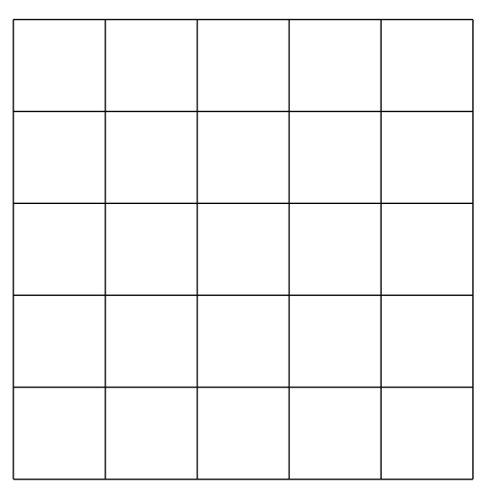

Miscellanées d'énigmes mathématiques.

??? {{ enigme() }} 

    [Calendrier mathématiques 2021](https://www.florilege-maths.fr/fiche/calendrier-mathematique-2021/)

    En marchant le long d'une rue, Pauline passe devant quatre maisons, toutes de couleurs différentes. Elle passe devant la maison orange avant la rouge et devant la bleue avant la jaune. La maison bleue n’est pas voisine de la jaune. De combien de manières différentes les maisons peuvent-elles être disposées ?

    ??? check "Solution"

        Notons O, R, B, J les quatre maisons.

        * __Contrainte 1 :__   on doit avoir    O avant R 
        * __Contrainte 2 :__   on doit avoir    B avant J
        * __Contrainte 3 :__   de plus B n'est pas voisine de J donc O ou R est entre B et J

        
        On en déduit les configurations possibles dans le sens de la marche de Pauline : 

        *  si O et R entre B et J, une seule configuration compatible avec les trois contraintes :
            *  B O R J
        * si O entre B et J :
            * B O J R
        * si R entre B et J :
            * O B R J

        Au total, les maisons peuvent être disposées de trois façons différentes.

??? {{ enigme() }} 

    [Calendrier mathématiques 2021](https://www.florilege-maths.fr/fiche/calendrier-mathematique-2021/)

    Quelle est la quantité maximale de carrés unitaires que l'on peut choisir de sorte que deux quelconques d'entre eux n'aient ni sommet ni côté en commun ?

    {: align=center width=100px}

    ??? check "Solution"

        On a $6 \times 6$ sommets donc au plus $\frac{36}{4}=9$ carrés dont tous les sommets sont distincts. Ceci nous donne un majorant. Si on choisit les carrés des colonnes impaires sur les lignes impaires, on a exactement 9 carrés dont les sommets et les arêtes sont tous distincts donc le maximum est atteint.

??? {{ enigme() }} 

    [Calendrier mathématiques 2021](https://www.florilege-maths.fr/fiche/calendrier-mathematique-2021/)
    
    On lance trois dés. Quelle est la probabilité que la somme soit strictement supérieure à 15 ?

    ??? check "Solution"

        La somme de trois dés est strictement supérieure à 15 si et seulement si elle est égale à 16, 17 ou 18 :

        * $18=6+6+6$ une décomposition
        * $17 = 6+6+5 = 6+5+6 = 5+6 + 6$ trois décompositions
        * $16 = 6+ 5 + 5 = 5 + 6 + 5 = 5 + 5 + 6 = 6 + 6 + 4 = 6 + 4 + 6 = 4 + 6 + 6$ six décompositions

        On a $6 \times 6 \times 6 = 216$ issues équiprobables, les triplets de résultats des trois lancers ce qui nous donne une probabilité de $\frac{10}{216}=\frac{5}{108}$.

??? {{ enigme() }}

    [Calendrier mathématiques 2021](https://www.florilege-maths.fr/fiche/calendrier-mathematique-2021/)

    Il existe un pays dans lequel il n'existe que des pièces de 5 et des pièces de 7. Quelle est la quantité maximale que l'on ne peut pas obtenir avec ces deux types de pièces ?

    ??? check "Solution"

        On commence par une exploration algorithmique :

        ~~~python
        #!/usr/bin/python3

        def est_decomposable(n, a, b):
            """Renvoie un booléen indiquant si n décomposable
            comme n = a * x + b * y
            """
            while n >= 0 and n % 7 != 0:
                n = n - 5
            return n >= 0

        def liste_decomposable(a, b, bsup):
            """Renvoie la liste des entiers <= bsup non décomposables
            sous la forme a*x + b * y"""
            return [n for n in range(bsup) if not est_decomposable(n,a,b) ]

        print(liste_decomposable(5, 7, 100))
        ~~~

        renvoie :

        ~~~python
        [1, 2, 3, 4, 6, 8, 9, 11, 13, 16, 18, 23]
        ~~~

        La série 24, 25, 26, 27, 28 est la première série de cinq entiers tous décomposables sous la forme $7x+5y$. Tous les entiers suivants  peuvent s'écrire sous la forme $24+5a$, $25+5b$, $26+5c$, $27+5d$ ou $28+5e$ donc sont décomposables sous la forme $7x+5y$.

        C'est un cas particulier du [problème de Frobenius](https://fr.wikipedia.org/wiki/Probl%C3%A8me_des_pi%C3%A8ces_de_monnaie#Nombres_McNugget) dont un autre cas particulier célèbre est constitué par les _Nombres Mc Nuggets_.

        ??? video

            <iframe width="732" height="384" src="https://www.youtube.com/embed/mJ9a_-LT_QA" title="YouTube video player" frameborder="0" allow="accelerometer; autoplay; clipboard-write; encrypted-media; gyroscope; picture-in-picture" allowfullscreen></iframe>

    

??? {{ enigme() }}

    [Calendrier mathématiques 2021](https://www.florilege-maths.fr/fiche/calendrier-mathematique-2021/)

    Quatre couples ont réservé pour dîner dans un restaurant. Toutes les personnes arrivent au restaurant séparément. Combien d'entre elles doivent arriver afin d'être sûr que, au minimum, un couple soit présent ?

    ??? check "Solution"

        On applique le [principe des tiroirs](https://fr.wikipedia.org/wiki/Principe_des_tiroirs) :

        * On a 4 couples soit 4 tiroirs.        
        * Chaque personne arrivant séparément au hasard appartient à un couple donc à un tiroir.

        À partir de 5 personnes, on a au moins deux personnes dans le même tiroir et donc au moins un couple.
