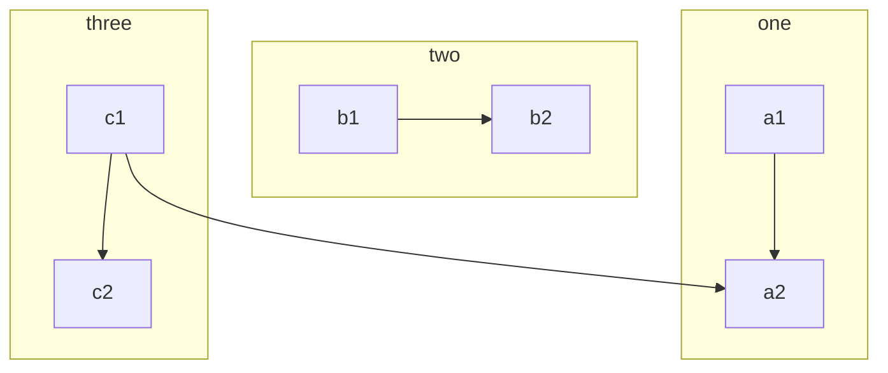

Référence pour les macros Mkdocs : <https://mkdocs-macros-plugin.readthedocs.io>

Tutoriel de référence par Franck Chambon : 

* <https://gitlab.com/ens-fr/mkdocs> 

* <https://ens-fr.gitlab.io/mkdocs/>


# Variables définies dans l'en-tête yaml :

Ici l'en-tête est :

~~~
title: My special title
bottles:
  whine: 500
  beer: 123
~~~

En écrivant `\{\{ page.meta.bottles.whine \}\}` (sans les \ ), on obtient :
{{ page.meta.bottles.whine }}. Voir <https://mkdocs-macros-plugin.readthedocs.io/en/latest/#variables>

# Abréviations

On peut insérer le contenu d'un fichier [d'abréviations](https://squidfunk.github.io/mkdocs-material/reference/abbreviations/), en modifiant éventuellement le répertoire par défaut ([`docs_dir`](https://www.mkdocs.org/user-guide/configuration/#docs_dir), voir cette [doc](https://mkdocs-macros-plugin.readthedocs.io/en/latest/advanced/#changing-the-directory-of-the-includes)) pour y placer les fichiers à inclure. 

On utilise la syntaxe Jinja2 ``.



Si on a défini l'abréviation `[Python]:https://docs.python.org/3.7/library/cgi.html` , on peut obtenir alors un lien hypertexte en écrivant le raccourci `[Python][Python]`.

[Python][Python]

On peut ainsi centraliser des abréviations et les mettre à jour automatiquement sur l'ensemble d'un site.

# Langage de template Jinja2 

## Boucles :

~~~


1. {{ user }}

~~~

donne 



1. {{ user }}



# Formatage de code

Voir <https://squidfunk.github.io/mkdocs-material/reference/code-blocks/>


        ``` python linenums="1"
        def bubble_sort(items):
            for i in range(len(items)):
                for j in range(len(items) - 1 - i):
                    if items[j] > items[j + 1]:
                        items[j], items[j + 1] = items[j + 1], items[j]
        ```

donne 

``` python linenums="1"
        def bubble_sort(items):
            for i in range(len(items)):
                for j in range(len(items) - 1 - i):
                    if items[j] > items[j + 1]:
```


        ``` python hl_lines="2 3"
        def bubble_sort(items):
            for i in range(len(items)):
                for j in range(len(items) - 1 - i):
                    if items[j] > items[j + 1]:
                        items[j], items[j + 1] = items[j + 1], items[j]
        ```

donne

``` python hl_lines="2 3"
def bubble_sort(items):
    for i in range(len(items)):
        for j in range(len(items) - 1 - i):
            if items[j] > items[j + 1]:
                items[j], items[j + 1] = items[j + 1], items[j]
```


# Insertion de console Pyodide 

Guillaume Connan voir <https://mooc-forums.inria.fr/moocnsi/t/du-python-cote-client-dans-une-page-web/1961/7>

`\{\{console()\}\}` 


donne


{{console()}}

# Insertion de scripts


En écrivant `\{\{ script('python', 'solution_scrabble.py') \}\}` (sans les \ )

(Macro de Franck Chambon dans `main.py`) donne :

{{ script('python', 'solution_scrabble.py') }}


!!! warning "Remarque" 
    
    Si on veut insérer du texte dans une page avec une macro définie dans `main.py`, on peut distinguer les cas où l'insertion se fait dans le fichier source `ma_page.md` ou dans le fichier HTML généré `ma_page.html` :

    * L'insertion du  code source d'un script Python avec  la macro `script` définie dans `main.py` (Franck Chambon) se fait dans le fichier Markdown et prend en argument le chemin relatif  du script par rapport au fichier `ma_page.md`. Ci-dessous on donne un autre exemple avec , un fichier Python dans sous-répertoire `'automatismes/automatismes.py'`, on écrit alors   `\{\{ script('python', 'automatismes/automatismes.py') \}\}` (sans les \).

    * La macro `basthon` définie dans `main.py` (Franck Chambon), insère une balise HTML, l'insertion aura lieu dans la page HTML généréee. Or Mkdocs construit à partir de al source Markdown  `ma_page.md` un réperotoire `map_page` contenant un fichier `index.html` avec le code HTML de la page générée. C'est pourquoi le chemin relatif vers la ressource change et il faut remonter d'un répertoire pour y accéder par rapport au chemin relatif depuis `ma_page.md` . Voir une explication [ici](https://mkdocs-macros-plugin.readthedocs.io/en/latest/tips/#how-do-i-deal-with-relative-links-to-documentsimages).

        ~~~python
            @env.macro
            def basthon(exo: str, hauteur: int) -> str: #F Chambon
                "Renvoie du HTML pour embarquer un fichier `exo` dans Basthon"
                return f"""<iframe src="https://console.basthon.fr/?from={env.variables.io_url}{env.variables.page.url}../{exo}" width=100% height={hauteur}></iframe>
        [Lien dans une autre page](https://console.basthon.fr/?from={env.variables.io_url}{env.variables.page.url}../{exo})
        """

            @env.macro
            def script(lang: str, nom: str) -> str: #F Chambon
                "Renvoie le script dans une balise bloc avec langage spécifié"
                return f"""```{lang}
        --8<---  "docs/""" + os.path.dirname(env.variables.page.url.rstrip('/')) + f"""/{nom}"
        ```"""
            #voir https://squidfunk.github.io/mkdocs-material/reference/code-blocks/#snippets
        ~~~

    * Si `mkdocs-jupyter` n'est pas activé, on écrira par exemple `\{\{ basthon('solution_scrabble.py', 800) \}\}` et `\{\{ basthon('automatismes/automatismes.py',800) \}\}`, comme pour `script` puisque la remontée de répertoire avec `../`  est codée dans la macro .
    
    * Mais si `mkdocs-jupyter` est  activé, lors de la compilation celui-ci a créé un répertoire par fichier `.py` ou `.ipynb` avec un `index.html` (export en HTML) et le fichier source (si option `include_source` à `true`), dans ce cas il faut rajouter un répertoire dans le chemin relatif. Ici par exemple : `\{\{ basthon('../solution_scrabble/solution_scrabble.py', 800) \}\}` et `\{\{ basthon('automatismes/automatismes/automatismes.py',800) \}\}`.

     * On peut changer la façon dont Mkdocs crée les URL à partir des sources en Markdown ; https://www.mkdocs.org/user-guide/configuration/#docs_dir mais ce n'est pas forcément recommandé par la doc. Par défaut à partir de `ma_page.md` il créé `ma_page/index.html` qui s'affiche en  `ma_page` et si on change le paramètre `use_directory_urls` ce sera `ma_page.html`


{{ script('python', 'automatismes/automatismes.py') }}


{{ basthon('solution_scrabble/solution_scrabble.py', 800) }}


{{ basthon('automatismes/automatismes/automatismes.py',800) }}

# Blocs personnalisés avec super_fences

Graphiques avec mermaid2 : <https://github.com/fralau/mkdocs-mermaid2-plugin> :

    ```mermaid
    graph TB
        c1-->a2
        subgraph one
        a1-->a2
        end
        subgraph two
        b1-->b2
        end
        subgraph three
        c1-->c2
        end
    ```

donne




* Références : 
  * <https://github.com/facelessuser/pymdown-extensions/issues/928>
  * <https://facelessuser.github.io/pymdown-extensions/>


