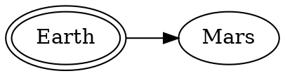

<<<<<<< HEAD
=======
# Insertion de graphiques en langages dot 

Module de Rodrigo Schwencke, voir  <https://pypi.org/project/mkdocs-markdown-graphviz/> et <https://gitlab.com/rodrigo.schwencke/mkdocs-markdown-graphviz>.
  

>>>>>>> 2657cb7fbc7b687d6360755eb262e70e2cdaed1e

  

