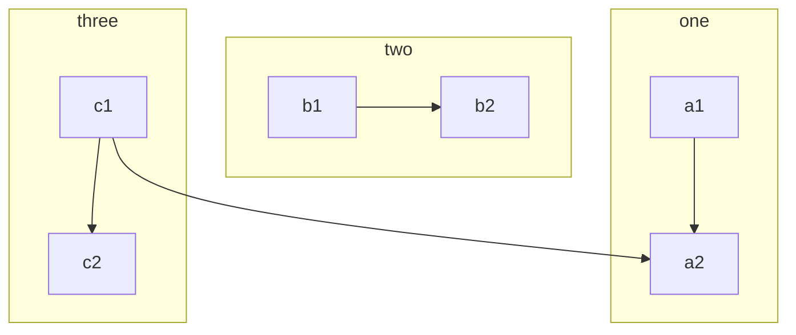

Référence pour les macros Mkdocs : <https://mkdocs-macros-plugin.readthedocs.io>


# Variables définies dans l'en-tête yaml :

Ici l'en-tête est :

~~~
title: My special title
bottles:
  whine: 500
  beer: 123
~~~

En écrivant `\{\{ page.meta.bottles.whine \}\}` (sans les \ ), on obtient :
{{ page.meta.bottles.whine }}

# Abréviations

On peut insérer le contenu d'un fichier [d'abréviations](https://squidfunk.github.io/mkdocs-material/reference/abbreviations/), en modifiant éventuellement le répertoire par défaut ([`docs_dir`](https://www.mkdocs.org/user-guide/configuration/#docs_dir), voir cette [doc](https://mkdocs-macros-plugin.readthedocs.io/en/latest/advanced/#changing-the-directory-of-the-includes)) pour y placer les fichiers à inclure. 

On utilise la syntaxe Jinja2 ``.



Si on a défini l'abréviation `[Python]:https://docs.python.org/3.7/library/cgi.html` , on peut obtenir alors un lien hypertexte en écrivant le raccourci `[Python][Python]`.

[Python][Python]

On peut ainsi centraliser des abréviations et les mettre à jour automatiquement sur l'ensemble d'un site.

# Langage de template Jinja2 

## Boucles :

~~~


1. {{ user }}

~~~

donne 



1. {{ user }}



# Insertion de scripts


En écrivant `\{\{ script('python', 'solution_scrabble.py') \}\}` (sans les \ )

(Macro de Franck Chambon dans `main.py`) donne :

{{ script('python', 'solution_scrabble.py') }}


!!! warning "Remarque"
    Dans l'exemple précédent `'solution_scrabble.py'` est dans le même répertoire
    que le fichier source de cette page. Si le script est dans un dossier, il faut remonter dans le répertoire parent (explication [ici](https://mkdocs-macros-plugin.readthedocs.io/en/latest/tips/#how-do-i-deal-with-relative-links-to-documentsimages)). Un exemple ci-dessous avec `'automatismes.py'`  qui se trouve dans `'automatismes/automatismes.py'`. Il faut alors écrire `\{\{ script('python', '../automatismes/automatismes.py') \}\}` (sans les \ )

{{ script('python', '../automatismes/automatismes.py') }}


# Blocs personnalisés avec super_fences

Graphiques avec mermaid2 : `https://github.com/fralau/mkdocs-mermaid2-plugin` :

    ```mermaid
    graph TB
        c1-->a2
        subgraph one
        a1-->a2
        end
        subgraph two
        b1-->b2
        end
        subgraph three
        c1-->c2
        end
    ```

donne



* Références : 
  * <https://github.com/facelessuser/pymdown-extensions/issues/928>
  * <https://facelessuser.github.io/pymdown-extensions/>


