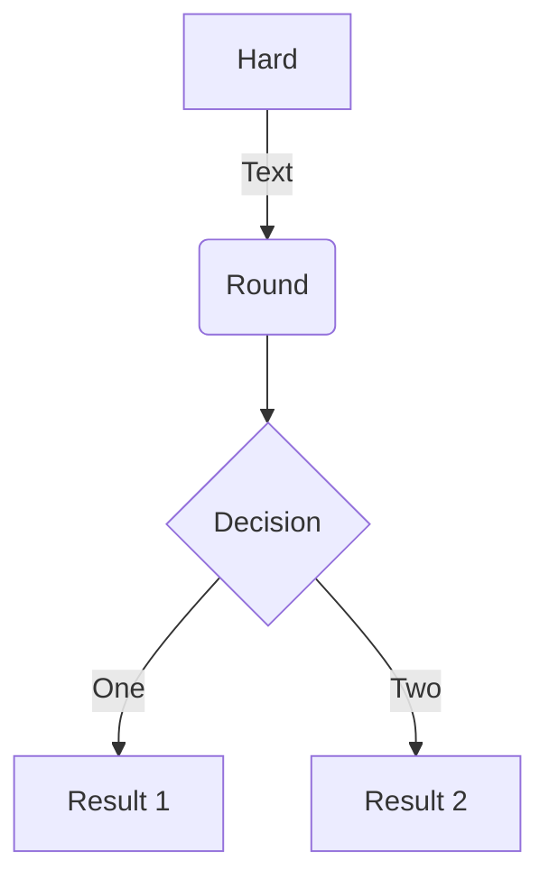

<https://mkdocs-macros-plugin.readthedocs.io>


# Variables définies dans l'en-tête yaml :

{{ page.meta.bottles.whine }}.


# Langage de template Jinja2 

## Boucles :

### List of users


1. {{ user }}


# Application d'un filtre 

{{ context(navigation.pages) | pretty }}


# Blocs personnalisés avec super_fences

* Références : 
  * <https://github.com/facelessuser/pymdown-extensions/issues/928>
  * <https://facelessuser.github.io/pymdown-extensions/>


~~~mermaid

%%{init: {'theme': 'dark' } }%%
graph TD
A --> B

~~~



???- note "Collapsed"
    ```mermaid
    graph TD
    A[Client] --> B[Load Balancer]
    ```
    This is additional text.


