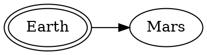
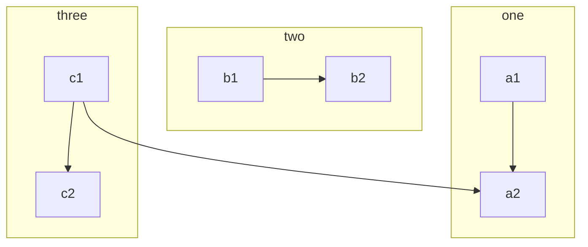

Pas de souci ci-dessus avec la syntaxe dot de l'extension <https://pypi.org/project/mkdocs-markdown-graphviz/>. ~~Mais si on ne place pas le bloc, il est détecté comme un bloc de code~~. Pas ce problème avec les deux autres syntaxes.


Encore un essai.


Référence pour les macros Mkdocs : <https://mkdocs-macros-plugin.readthedocs.io>

Tutoriel de référence par Franck Chambon : 

* <https://gitlab.com/ens-fr/mkdocs> 

* <https://ens-fr.gitlab.io/mkdocs/>

# Blocs personnalisés avec super_fences

Graphiques avec mermaid2 : <https://github.com/fralau/mkdocs-mermaid2-plugin> :

    ```mermaid
    graph TB
        c1-->a2
        subgraph one
        a1-->a2
        end
        subgraph two
        b1-->b2
        end
        subgraph three
        c1-->c2
        end
    ```

donne




* Références : 
  * <https://github.com/facelessuser/pymdown-extensions/issues/928>
  * <https://facelessuser.github.io/pymdown-extensions/>


# Insertion de graphiques en langages dot 

Module de Rodrigo Schwencke, voir  <https://gitlab.com/rodrigo.schwencke/mkdocs-graphviz>.

Exemples ci-dessous avec les trois syntaxes. 


# Insertion de diagrammes avec Kroki

<https://kroki.io/>

Voir exemples de Franck Chambon <https://ens-fr.gitlab.io/sandbox/3_kroki/#entity-relationship-diagram>

Galerie d'exemples : <https://kroki.io/examples.html>

:warning: Échec dans une balise ````` ````kroki-... ````` ; seulement 3 `` ` `` autorisés.

## Block diagram

* BlockDiag

```kroki-blockdiag
blockdiag {
  blockdiag -> generates -> "block-diagrams";
  blockdiag -> is -> "very easy!";

  blockdiag [color = "greenyellow"];
  "block-diagrams" [color = "pink"];
  "very easy!" [color = "orange"];
}
```

* Graphviz

```kroki-graphviz


digraph "unix" {
  graph [ fontname = "Helvetica-Oblique",
          fontsize = 36,
          label = "\n\n\n\nObject Oriented Graphs\nStephen North, 3/19/93",
          size = "6,6" ];
  node [ shape = polygon,
         sides = 4,
         distortion = "0.0",
         orientation = "0.0",
         skew = "0.0",
         color = white,
         style = filled,
         fontname = "Helvetica-Outline" ];
  "5th Edition" [sides=9, distortion="0.936354", orientation=28, skew="-0.126818", color=salmon2];
  "6th Edition" [sides=5, distortion="0.238792", orientation=11, skew="0.995935", color=deepskyblue];
  "PWB 1.0" [sides=8, distortion="0.019636", orientation=79, skew="-0.440424", color=goldenrod2];
  LSX [sides=9, distortion="-0.698271", orientation=22, skew="-0.195492", color=burlywood2];
  "1 BSD" [sides=7, distortion="0.265084", orientation=26, skew="0.403659", color=gold1];
  "Mini Unix" [distortion="0.039386", orientation=2, skew="-0.461120", color=greenyellow];
  Wollongong [sides=5, distortion="0.228564", orientation=63, skew="-0.062846", color=darkseagreen];
  Interdata [distortion="0.624013", orientation=56, skew="0.101396", color=dodgerblue1];
  "Unix/TS 3.0" [sides=8, distortion="0.731383", orientation=43, skew="-0.824612", color=thistle2];
  "PWB 2.0" [sides=6, distortion="0.592100", orientation=34, skew="-0.719269", color=darkolivegreen3];
  "7th Edition" [sides=10, distortion="0.298417", orientation=65, skew="0.310367", color=chocolate];
  "8th Edition" [distortion="-0.997093", orientation=50, skew="-0.061117", color=turquoise3];
  "32V" [sides=7, distortion="0.878516", orientation=19, skew="0.592905", color=steelblue3];
  V7M [sides=10, distortion="-0.960249", orientation=32, skew="0.460424", color=navy];
  "Ultrix-11" [sides=10, distortion="-0.633186", orientation=10, skew="0.333125", color=darkseagreen4];
  Xenix [sides=8, distortion="-0.337997", orientation=52, skew="-0.760726", color=coral];
  "UniPlus+" [sides=7, distortion="0.788483", orientation=39, skew="-0.526284", color=darkolivegreen3];
  "9th Edition" [sides=7, distortion="0.138690", orientation=55, skew="0.554049", color=coral3];
  "2 BSD" [sides=7, distortion="-0.010661", orientation=84, skew="0.179249", color=blanchedalmond];
  "2.8 BSD" [distortion="-0.239422", orientation=44, skew="0.053841", color=lightskyblue1];
  "2.9 BSD" [distortion="-0.843381", orientation=70, skew="-0.601395", color=aquamarine2];
  "3 BSD" [sides=10, distortion="0.251820", orientation=18, skew="-0.530618", color=lemonchiffon];
  "4 BSD" [sides=5, distortion="-0.772300", orientation=24, skew="-0.028475", color=darkorange1];
  "4.1 BSD" [distortion="-0.226170", orientation=38, skew="0.504053", color=lightyellow1];
  "4.2 BSD" [sides=10, distortion="-0.807349", orientation=50, skew="-0.908842", color=darkorchid4];
  "4.3 BSD" [sides=10, distortion="-0.030619", orientation=76, skew="0.985021", color=lemonchiffon2];
  "Ultrix-32" [distortion="-0.644209", orientation=21, skew="0.307836", color=goldenrod3];
  "PWB 1.2" [sides=7, distortion="0.640971", orientation=84, skew="-0.768455", color=cyan];
  "USG 1.0" [distortion="0.758942", orientation=42, skew="0.039886", color=blue];
  "CB Unix 1" [sides=9, distortion="-0.348692", orientation=42, skew="0.767058", color=firebrick];
  "USG 2.0" [distortion="0.748625", orientation=74, skew="-0.647656", color=chartreuse4];
  "CB Unix 2" [sides=10, distortion="0.851818", orientation=32, skew="-0.020120", color=greenyellow];
  "CB Unix 3" [sides=10, distortion="0.992237", orientation=29, skew="0.256102", color=bisque4];
  "Unix/TS++" [sides=6, distortion="0.545461", orientation=16, skew="0.313589", color=mistyrose2];
  "PDP-11 Sys V" [sides=9, distortion="-0.267769", orientation=40, skew="0.271226", color=cadetblue1];
  "USG 3.0" [distortion="-0.848455", orientation=44, skew="0.267152", color=bisque2];
  "Unix/TS 1.0" [distortion="0.305594", orientation=75, skew="0.070516", color=orangered];
  "TS 4.0" [sides=10, distortion="-0.641701", orientation=50, skew="-0.952502", color=crimson];
  "System V.0" [sides=9, distortion="0.021556", orientation=26, skew="-0.729938", color=darkorange1];
  "System V.2" [sides=6, distortion="0.985153", orientation=33, skew="-0.399752", color=darkolivegreen4];
  "System V.3" [sides=7, distortion="-0.687574", orientation=58, skew="-0.180116", color=lightsteelblue1];
  "5th Edition" -> "6th Edition";
  "5th Edition" -> "PWB 1.0";
  "6th Edition" -> LSX;
  "6th Edition" -> "1 BSD";
  "6th Edition" -> "Mini Unix";
  "6th Edition" -> Wollongong;
  "6th Edition" -> Interdata;
  Interdata -> "Unix/TS 3.0";
  Interdata -> "PWB 2.0";
  Interdata -> "7th Edition";
  "7th Edition" -> "8th Edition";
  "7th Edition" -> "32V";
  "7th Edition" -> V7M;
  "7th Edition" -> "Ultrix-11";
  "7th Edition" -> Xenix;
  "7th Edition" -> "UniPlus+";
  V7M -> "Ultrix-11";
  "8th Edition" -> "9th Edition";
  "1 BSD" -> "2 BSD";
  "2 BSD" -> "2.8 BSD";
  "2.8 BSD" -> "Ultrix-11";
  "2.8 BSD" -> "2.9 BSD";
  "32V" -> "3 BSD";
  "3 BSD" -> "4 BSD";
  "4 BSD" -> "4.1 BSD";
  "4.1 BSD" -> "4.2 BSD";
  "4.1 BSD" -> "2.8 BSD";
  "4.1 BSD" -> "8th Edition";
  "4.2 BSD" -> "4.3 BSD";
  "4.2 BSD" -> "Ultrix-32";
  "PWB 1.0" -> "PWB 1.2";
  "PWB 1.0" -> "USG 1.0";
  "PWB 1.2" -> "PWB 2.0";
  "USG 1.0" -> "CB Unix 1";
  "USG 1.0" -> "USG 2.0";
  "CB Unix 1" -> "CB Unix 2";
  "CB Unix 2" -> "CB Unix 3";
  "CB Unix 3" -> "Unix/TS++";
  "CB Unix 3" -> "PDP-11 Sys V";
  "USG 2.0" -> "USG 3.0";
  "USG 3.0" -> "Unix/TS 3.0";
  "PWB 2.0" -> "Unix/TS 3.0";
  "Unix/TS 1.0" -> "Unix/TS 3.0";
  "Unix/TS 3.0" -> "TS 4.0";
  "Unix/TS++" -> "TS 4.0";
  "CB Unix 3" -> "TS 4.0";
  "TS 4.0" -> "System V.0";
  "System V.0" -> "System V.2";
  "System V.2" -> "System V.3";
}
```

# Variables définies dans l'en-tête yaml :

Ici l'en-tête est :

~~~
title: My special title
bottles:
  whine: 500
  beer: 123
~~~

En écrivant `\{\{ page.meta.bottles.whine \}\}` (sans les \ ), on obtient :
{{ page.meta.bottles.whine }}. Voir <https://mkdocs-macros-plugin.readthedocs.io/en/latest/#variables>

# Abréviations

On peut insérer le contenu d'un fichier [d'abréviations](https://squidfunk.github.io/mkdocs-material/reference/abbreviations/), en modifiant éventuellement le répertoire par défaut ([`docs_dir`](https://www.mkdocs.org/user-guide/configuration/#docs_dir), voir cette [doc](https://mkdocs-macros-plugin.readthedocs.io/en/latest/advanced/#changing-the-directory-of-the-includes)) pour y placer les fichiers à inclure. 

On utilise la syntaxe Jinja2 ``.



Si on a défini l'abréviation `[Python]:https://docs.python.org/3.7/library/cgi.html` , on peut obtenir alors un lien hypertexte en écrivant le raccourci `[Python][Python]`.

[Python][Python]

On peut ainsi centraliser des abréviations et les mettre à jour automatiquement sur l'ensemble d'un site.

# Langage de template Jinja2 

## Boucles :

~~~


1. {{ user }}

~~~

donne 



1. {{ user }}



# Formatage de code

Voir <https://squidfunk.github.io/mkdocs-material/reference/code-blocks/>


        ``` python linenums="1"
        def bubble_sort(items):
            for i in range(len(items)):
                for j in range(len(items) - 1 - i):
                    if items[j] > items[j + 1]:
                        items[j], items[j + 1] = items[j + 1], items[j]
        ```

donne 

``` python linenums="1"
        def bubble_sort(items):
            for i in range(len(items)):
                for j in range(len(items) - 1 - i):
                    if items[j] > items[j + 1]:
```


        ``` python hl_lines="2 3"
        def bubble_sort(items):
            for i in range(len(items)):
                for j in range(len(items) - 1 - i):
                    if items[j] > items[j + 1]:
                        items[j], items[j + 1] = items[j + 1], items[j]
        ```

donne

``` python hl_lines="2 3"
def bubble_sort(items):
    for i in range(len(items)):
        for j in range(len(items) - 1 - i):
            if items[j] > items[j + 1]:
                items[j], items[j + 1] = items[j + 1], items[j]
```


# Insertion de console Pyodide 

## Console de Guillaume Connan 

Une console directement inspirée du travail de Guillaume Connan voir <https://mooc-forums.inria.fr/moocnsi/t/du-python-cote-client-dans-une-page-web/1961/7> et <https://giyom.gitlab.io/ecs1/2020_21/bac_a_sable/>.

Voir <https://parc-nsi.github.io/premiere/automatismes/exo1_fonctions/>.


## Console de Vincent Bouillot

Voir tutoriel complet sur <https://bouillotvincent.gitlab.io/pyodide-mkdocs>. En voici un extrait : 

!!! summary "La syntaxe"

    === "Terminal"
        ```markdown
        
        {{ terminal() }}
        
        ```
        Cette commande crée un terminal vide. L'auto-complétion avec ++tab++ et le rappel de l'historique (avec ++ctrl+"R"++ ) sont possibles.

        !!! console "console réalisée par Vincent Bouillot"

            {{ terminal() }}

    === "IDE vide"
        ```markdown
        
        {{ IDE() }}
        
        ```
        Cette commande crée un IDE(~ Thonny) vide. L'engrenage permet de lancer le code tapé dans la zone de saisie (avec les numéros de ligne). La zone de saisie se redimensionne automatiquement et autorise l'auto-complétion avec ++tab++.

        !!! IDE

            {{IDE()}}


    === "IDE vertical"
        ```markdown
        
        {{ IDEv('') }}
        
        ```
        Cette commande crée un IDE vertical (~ Thonny) vide. L'engrenage permet de lancer le code tapé dans la zone de saisie (avec les numéros de ligne). La zone de saisie se redimensionne automatiquement et autorise l'auto-complétion avec ++tab++.

        !!! IDE

            {{IDEv('')}}


# Insertion de scripts


En écrivant `\{\{ script('python', 'solution_scrabble.py') \}\}` (sans les \ )

(Macro de Franck Chambon dans `main.py`) donne :

{{ script('python', 'solution_scrabble.py') }}


!!! warning "Remarque" 
    
    Si on veut insérer du texte dans une page avec une macro définie dans `main.py`, on peut distinguer les cas où l'insertion se fait dans le fichier source `ma_page.md` ou dans le fichier HTML généré `ma_page.html` :

    * L'insertion du  code source d'un script Python avec  la macro `script` définie dans `main.py` (Franck Chambon) se fait dans le fichier Markdown et prend en argument le chemin relatif  du script par rapport au fichier `ma_page.md`. Ci-dessous on donne un autre exemple avec , un fichier Python dans sous-répertoire `'automatismes/automatismes.py'`, on écrit alors   `\{\{ script('python', 'automatismes/automatismes.py') \}\}` (sans les \).

    * La macro `basthon` définie dans `main.py` (Franck Chambon), insère une balise HTML, l'insertion aura lieu dans la page HTML généréee. Or Mkdocs construit à partir de al source Markdown  `ma_page.md` un réperotoire `map_page` contenant un fichier `index.html` avec le code HTML de la page générée. C'est pourquoi le chemin relatif vers la ressource change et il faut remonter d'un répertoire pour y accéder par rapport au chemin relatif depuis `ma_page.md` . Voir une explication [ici](https://mkdocs-macros-plugin.readthedocs.io/en/latest/tips/#how-do-i-deal-with-relative-links-to-documentsimages).

        ~~~python
            @env.macro
            def basthon(exo: str, hauteur: int) -> str: #F Chambon
                "Renvoie du HTML pour embarquer un fichier `exo` dans Basthon"
                return f"""<iframe src="https://console.basthon.fr/?from={env.variables.io_url}{env.variables.page.url}../{exo}" width=100% height={hauteur}></iframe>
        [Lien dans une autre page](https://console.basthon.fr/?from={env.variables.io_url}{env.variables.page.url}../{exo})
        """

            @env.macro
            def script(lang: str, nom: str) -> str: #F Chambon
                "Renvoie le script dans une balise bloc avec langage spécifié"
                return f"""```{lang}
        --8<---  "docs/""" + os.path.dirname(env.variables.page.url.rstrip('/')) + f"""/{nom}"
        ```"""
            #voir https://squidfunk.github.io/mkdocs-material/reference/code-blocks/#snippets
        ~~~

    * Si `mkdocs-jupyter` n'est pas activé, on écrira par exemple `\{\{ basthon('solution_scrabble.py', 800) \}\}` et `\{\{ basthon('automatismes/automatismes.py',800) \}\}`, comme pour `script` puisque la remontée de répertoire avec `../`  est codée dans la macro .
    
    * Mais si `mkdocs-jupyter` est  activé, lors de la compilation celui-ci a créé un répertoire par fichier `.py` ou `.ipynb` avec un `index.html` (export en HTML) et le fichier source (si option `include_source` à `true`), dans ce cas il faut rajouter un répertoire dans le chemin relatif. Ici par exemple : `\{\{ basthon('../solution_scrabble/solution_scrabble.py', 800) \}\}` et `\{\{ basthon('automatismes/automatismes/automatismes.py',800) \}\}`.

     * On peut changer la façon dont Mkdocs crée les URL à partir des sources en Markdown ; https://www.mkdocs.org/user-guide/configuration/#docs_dir mais ce n'est pas forcément recommandé par la doc. Par défaut à partir de `ma_page.md` il créé `ma_page/index.html` qui s'affiche en  `ma_page` et si on change le paramètre `use_directory_urls` ce sera `ma_page.html`

    * Noter que les iframes basthon font crasher le chargement de la page sur mobile.


{{ script('python', 'automatismes/automatismes.py') }}


<!-- {{ basthon('solution_scrabble/solution_scrabble.py', 800) }} -->


<!-- {{ basthon('automatismes/automatismes/automatismes.py',800) }} -->


